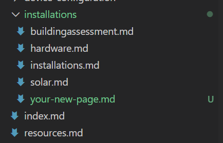
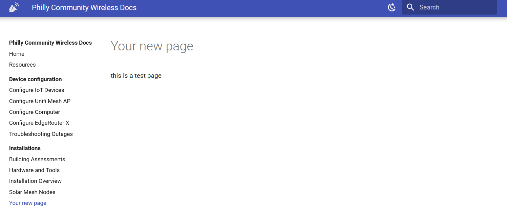
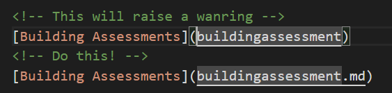

# PCW Documentation
Technical documentation and onboarding materials for Philly Community Wireless. 

Deploy previews via [`Render`](https://render.com/)

Built with [`mkdocs`](https://www.mkdocs.org) (via [Material Theme](https://squidfunk.github.io/mkdocs-material/))
and deployed to [readthedocs.org](readthedocs.org)

[](https://docs.phillycommunitywireless.org/en/latest/?badge=latest)

Access the docs here - https://docs.phillycommunitywireless.org

# Editing these docs

## Editing on GitHub
After receiving access to the repository, edits can be made to the site's code directly from the GitHub web editor. Just find the file you'd like to edit (the filename will be the same as the page's slug) and click the pencil icon in the corner. Once you've completed your changes, scroll to the bottom, add a commit message, and click "Commit changes".

**The `main` branch has merge protections enabled;** to propose edits, commit your chanages to a new branch and open a pull request. This will generate a deploy preview using `Render` which will then be approved or denied. 


## Editing locally
This is only necessary if you need to see how the docs are specifically rendered on our live site. Any markdown editor should be able to preview the docs as they will appear on the site, without much deviation. If you want to make styling / structural changes to the site and/or its theme, this is also the way to do that.

To make edits to the docs locally, you'll need to have a GitHub account and be listed as a contributor to the `phillycommunitywireless/docs` repository. You'll also need `git` and a markdown editor of your choice.

### 1) Configure Development Environment

#### Docker
* Download [Docker](https://www.docker.com), which should include Docker Compose on most machines.
* Clone this repository - `https://github.com/phillycommunitywireless/docs.git`
* Run `docker-compose up` inside the project directory: 
```
cd docs 
docker-compose up
```
* The mkdocs server will start up, and can be accessed at `http://localhost:8000`. Any changes made to the docs will automatically update the page.

#### Virtual Environment
If you need your development environment to integrate with other programs on your machine, e.g. for linting in a text editor, you'll need to set up a Python virtual environment with the necessary dependencies installed.

First things first: if you haven't already done so copy the docs repository to your local machine:

```
git clone https://github.com/phillycommunitywireless/docs.git
cd docs
```

If you already have the repo cloned, you should pull any new changes to synchronize with the remote repo:

```
git pull
```

Make sure you have Python 3 and pip installed, and run the following commands:

```
# install the pipenv package
pip install pipenv

# create a virtual environment and install dependencies in it
pipenv install -r requirements.txt
```

Your dependencies are now installed in a virtual environment (usually located somewhere in your $HOME/.local/ folder). To active the environment on the command line, type `pipenv shell`. If you're using Visual Studio Code for editing, change the Python Interpreter setting to point to the path returned by pipenv which python.


### 2) Making edits to site data

#### Edit markdown files
You should see several markdown files in the docs/docs subfolder. These correspond to the pages on the main site. You can open and edit these files in a markdown editor of your choice!

#### Finalizing your changes
Once you're confident in the changes you've made to the docs, you can push them back to the remote repo. 

**The `main` branch has merge protections enabled;** to propose edits, commit your chanages to a new branch and open a pull request. This will generate a deploy preview using `Render` which will then be approved or denied. 

```
git checkout -b your-branch-name
git add .
git commit -m "Add a message specifying what you changed"
git push
```

If this is your first time pushing, you may need to run this instead:

```
git push --set-upstream origin your-branch-name
```

#### Adding new files
To add a new page, simply add a new `.md` file to the desired parent directory; your new page will appear as child item of the directory. 





#### Updating links 
Links to other pages on the doc should be suffixed by `.md` to avoid warnings at runtime. 


