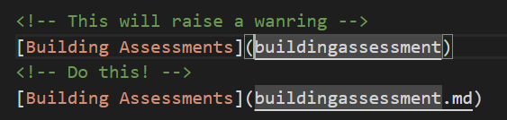

# PCW Documentation
Technical documentation and onboarding materials for Philly Community Wireless.

Access the docs here - https://docs.phillycommunitywireless.org

Built with [`mkdocs`](https://www.mkdocs.org) (via [Material Theme](https://squidfunk.github.io/mkdocs-material/))
and deployed to [Read the Docs](https://readthedocs.org/projects/pcwdocs/).

[](https://docs.phillycommunitywireless.org/en/latest/?badge=latest)

Deploy previews via [Render](https://github.com/phillycommunitywireless/phillycommunitywireless/wiki/Deploy-Previews) — every pull request gets a live preview URL.

# How the repo is laid out

```
docs/
  en/             English pages (the default language)
  es/             Spanish pages, mirroring en/ file for file
  assets/         images, icons and config files shared by both languages
  stylesheets/    extra CSS
includes/
  abbreviations.md  hover definitions for acronyms, added to every page
hooks/            small Python build hooks
mkdocs.yml        production settings and nav (what the live site shows)
mkdocs.dev.yml    local development nav, which also lists draft pages
```

A page's URL comes from its path under `docs/en/`: `docs/en/installations/solar.md` is served at `/installations/solar/`, and its Spanish version `docs/es/installations/solar.md` at `/es/installations/solar/`.

# Editing these docs

## Editing on GitHub
After receiving access to the repository, edits can be made directly from the GitHub web editor. Find the file you'd like to edit under `docs/en/` or `docs/es/` (the filename matches the end of the page's URL) and click the pencil icon in the corner. Once you've completed your changes, scroll to the bottom, add a commit message, and click "Commit changes".

**The `main` branch has merge protections enabled;** to propose edits, commit your changes to a new branch and open a pull request. This will generate a deploy preview using Render, and a maintainer will review it.

## Editing locally
This is only necessary if you need to see exactly how the docs render on the live site, or you're making styling / structural changes to the site and its theme. Any markdown editor can preview the page content itself without much deviation.

To make edits locally, you'll need a GitHub account with contributor access to the `phillycommunitywireless/docs` repository, `git`, and a markdown editor of your choice.

First, copy the repository to your machine:

```
git clone https://github.com/phillycommunitywireless/docs.git
cd docs
```

If you already have it cloned, pull any new changes first with `git pull`.

### Option 1: Docker
* Install [Docker](https://www.docker.com), which includes Docker Compose on most machines.
* Run `docker compose up` inside the project directory.
* The docs are served at `http://localhost:8000`, including draft pages. Any changes you save update the page automatically.

To preview the production site instead (drafts hidden, served by Caddy like the live server), uncomment the `APP_TAG=production` lines in `docker-compose.yml`.

### Option 2: Python virtual environment
Use this if you want editor integrations such as linting, or don't want to install Docker. You'll need Python 3.

```
python3 -m venv .venv
source .venv/bin/activate        # on Windows: .venv\Scripts\activate
pip install -r requirements.txt
```

Then start the development server:

```
mkdocs serve -f mkdocs.dev.yml
```

The docs are served at `http://127.0.0.1:8000`, with draft pages included. Run `mkdocs serve` without `-f mkdocs.dev.yml` to see only what the live site will show.

If you're using Visual Studio Code, point its Python interpreter setting at `.venv`.

## Adding a new page
The site's navigation is listed by hand, so a new `.md` file won't appear in the menu until you add it there.

1. Create the file under `docs/en/`, in the folder that fits (e.g. `docs/en/installations/`). Start it with a title:
   ```
   ---
   title: Your New Page
   ---

   # Your New Page
   ```
2. If the page isn't ready to publish, add it to `draft_docs` in `mkdocs.yml` as `/*/folder/your-new-page.md`. The `/*/` makes the line hide both the English and Spanish versions from the live site.
3. Add it to the nav:
    * **Draft:** add it only to the `nav:` in `mkdocs.dev.yml`, where it will eventually live. It will show up when you run the dev server but not on the live site.
    * **Ready to publish:** add it to the `nav:` in `mkdocs.yml` (and `mkdocs.dev.yml`, if it isn't there already), and remove its line from `draft_docs`.
4. Add a Spanish translation of the menu label under `nav_translations` in `mkdocs.yml`, and a Spanish version of the page at the same path under `docs/es/` (see below).

## Spanish translations
Every page in `docs/en/` should have a counterpart at the same path in `docs/es/`. If a Spanish page is missing, Spanish readers see the English page instead.

Some Spanish pages are machine-drafted placeholders that still need review by a fluent speaker. They start with a "Traducción preliminar" notice and a `<!-- TODO: machine-drafted Spanish translation ... -->` comment. When you've reviewed one, delete both. To find the ones left:

```
grep -rl "TODO: machine-drafted" docs/es
```

Anchor links (`page.md#some-heading`) use the heading text, so a link into a Spanish page must use the Spanish heading's anchor, e.g. `configure-computer.md#configurar-una-direccion-ip-estatica`.

Known limitation: the dev server shows Spanish draft pages in the menu, but opening one gives a 404. The translation plugin builds the Spanish site separately and always leaves drafts out. Preview the English draft instead.

## Links
Links to other pages in the docs should point at the `.md` file, relative to the current page, so mkdocs can check them when it builds.



Before opening a pull request, you can check for broken internal links by running:

```
mkdocs build --strict
```

## Finalizing your changes
Once you're confident in your changes, push them to a new branch and open a pull request:

```
git checkout -b your-branch-name
git add .
git commit -m "Add a message specifying what you changed"
git push --set-upstream origin your-branch-name
```
