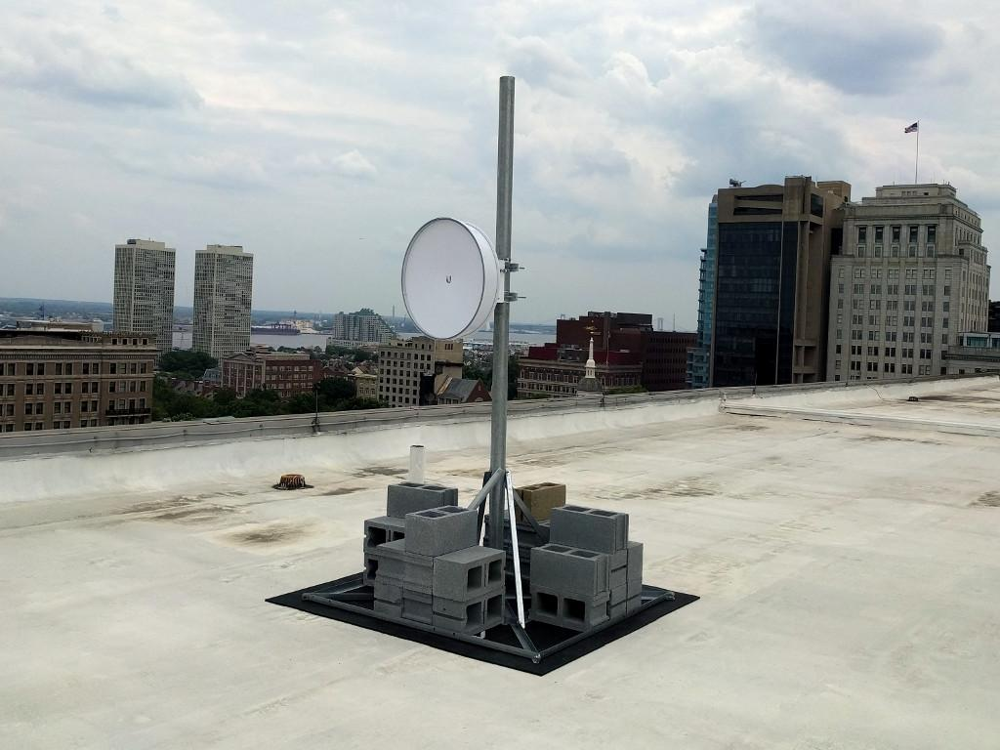
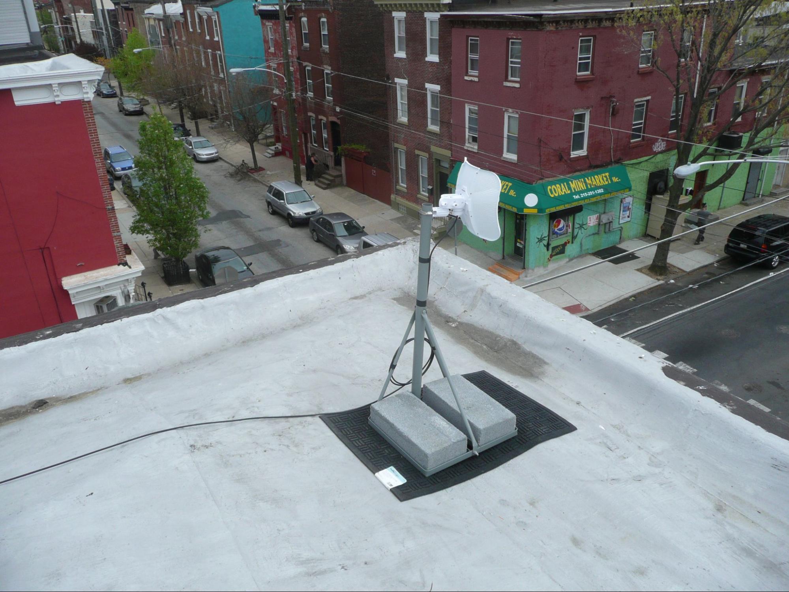
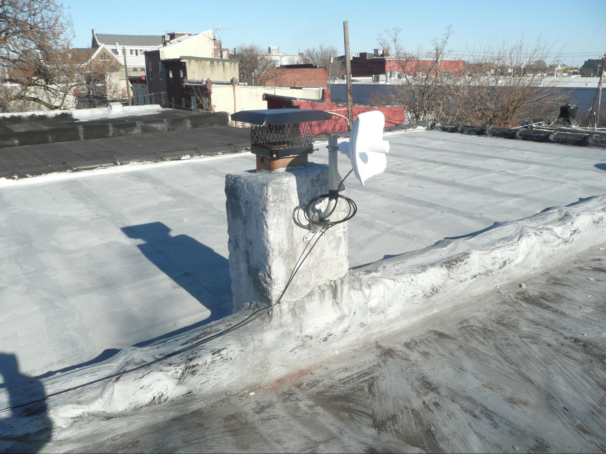
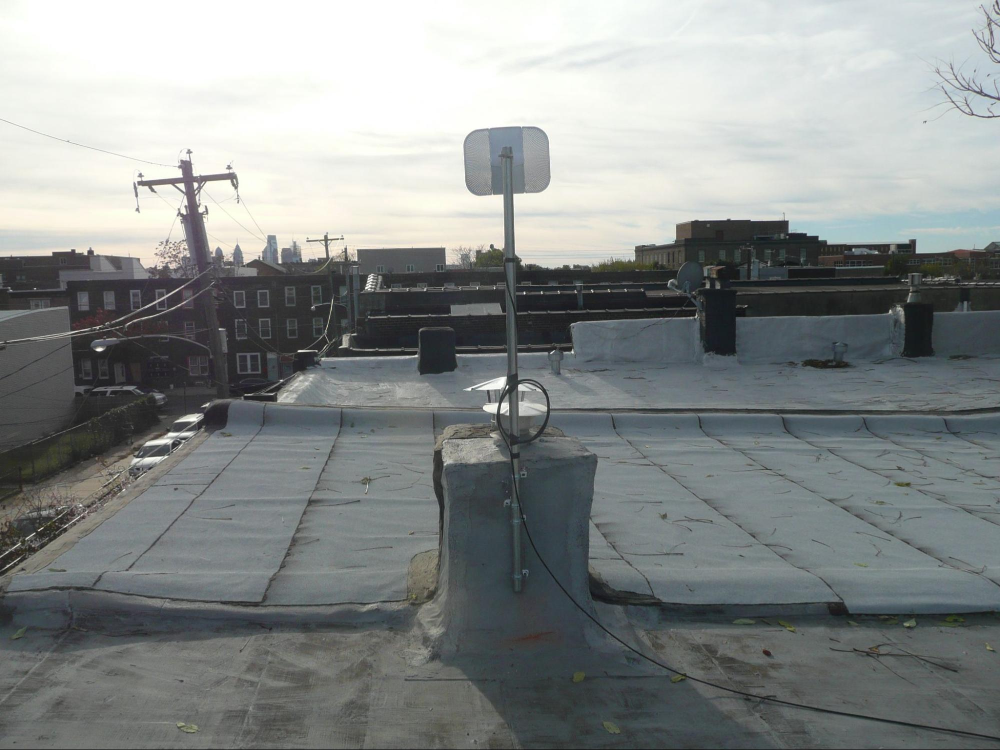
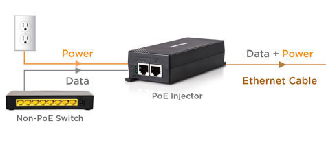
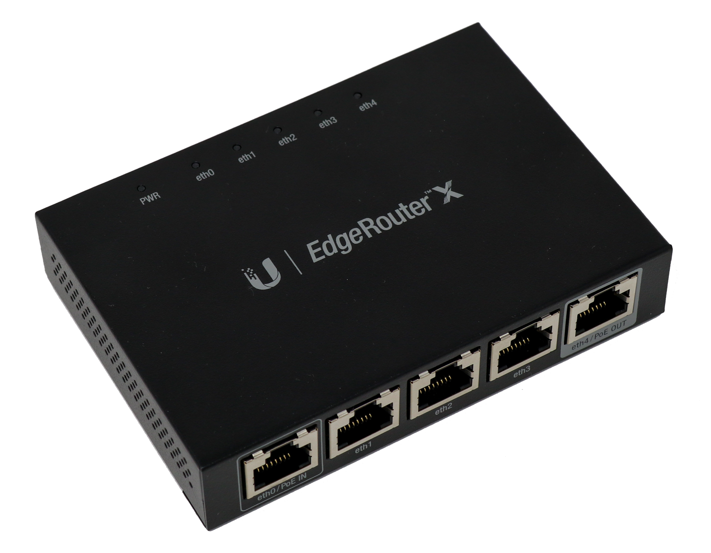

# Installation Overview
Philly Community Wireless has partnered with [**PhillyWisper**](https://phillywisper.net/) to install antennas for our free WiFi network on rooftops in the Norris Square, Fairhill, and Kensington neighborhoods. PhillyWisper is a wireless internet service provider (WISP) which means our project delivers the internet the "last mile" to our customers using radio technology.

Philly Community Wireless seeks to build community-owned and community-operated wireless mesh network technologies. This page describes our process for installation and the type of network we are trying to build over a large expanse of the city. In a typical home network, all 'access points' (APs) are hard-wired to your router via Ethernet cable. In a mesh network, access points can not only be hard-wired, but connect to each other wirelessly, allowing a single Internet connection to be shared with significantly less infrastructure and labor than hard-wiring every single AP. 

## Rooftop Installation Process
Most installations proceed in the following order:

1. **Building Assessment** - A new address is submitted to us. We check if the address has line of sight (LoS) to a PhillyWisper high site using Google Earth and other mapping tools, and we conduct both remote and in-person building assessments as part of developing an install plan. For more information, please see [Building Assessments](../buildingassessment) page.

2. **Install Planning** - If there is LoS, we communicate with the resident or community organization to determine their connectivity needs, as well as needs of neighbors and the general area. This helps us determine what sort of access points and networking equipment to bring, as well as how much cable we will need. Once the logistics for the initial install are determined, an install date is set! 

3. **Establish uplink** - On the day of the install, PCW will begin by installing the uplink radio pointing back at a PhillyWisper high site, usually a [LiteBeam](https://store.ui.com/us/en/products/litebeam-5ac). This provides the internet connection. 

4. **Deploy access points** - Once the uplink is set up, we can begin running cable on the roof or through the buliding and deploying WiFi access points as needed, either indoors or outdoors. For more info, see our [Configure AP-Mesh Guide](../../Device-Configuration/configure-ap-mesh) and our [Configure ERX Router Guide](../../Device-Configuration/configure-erx)

During residential installs, we either broadcast a private network for the resident to use from the same access points broadcasting the public PCW network, or provide an additional router for the resident to have their own private network that gets its uplink from the PCW network. 

## Length of Time for Antenna Installations
Typically, installs take between two and four hours to complete, but in certain cases they can take longer. The full installation process, from a rooftop antenna to a wall-mounted mesh kit, can involve 2-3 visits, each involving an hour or two of work.

## Hardware for Installation
Internet installations typically consist of a rooftop antenna, a power-over-Ethernet injector, a router, and a WiFi access point (all of which are typically Ubiquiti networking equipment). During installation we take every effort to minimally impact buildings. At any given install site, our installation work will be customized to ensure the least invasive and most secure placement of networking equipment, according to industry standards. 

For most locations, we first install a Ubiquiti LiteBeam antenna on the roof of the home, which receives signal from a nearby high site managed by PhillyWisper. To install the rooftop antenna, PhillyWisper technicians will access a high point and mount a small radio antenna (approx 14" x 11" x 11", see attached images of various mounting techniques below) that they precision aim  at the closest source tower. For mounting the radio, we never penetrate the roofing system itself, and wherever possible we utilize preexisting structures (chimneys, vent pipes, etc). If preexisting structures aren't an option, we use a non-penetrating roof mount, which is properly weighed down and rests on a rubber mat on top of your roof. 

The rooftop radio gets powered via outdoor-rated Ethernet cable that runs into the home (our equipment uses Power over Ethernet (PoE), so we can power outdoor devices with Ethernet from an indoor outlet). We make sure the wire run is as inconspicuous and secure as possible. We try to use preexisting penetrations into the building from previous ISPs, and we seal any holes to the exterior.

## Installation Examples

### Non-Penetrating Roof Mounts
We utilize non-penetrating roof mounts (NPRM). A thick rubber mat is placed below the NPRM to protect the roof. Cinderblocks are used as ballast to secure the NPRM:

<figure style="display: flex; justify-content: center; align-items: center; flex-direction: column;">
    
    <figcaption>A non-penetrating roof mount</figcaption>
</figure>

<figure style="display: flex; justify-content: center; align-items: center; flex-direction: column;">
    
    <figcaption>Another example of a non-penetrating roof mount</figcaption>
</figure>

### Mounting on existing roof structures
We also often use j-arm mounts or previously existing mounts from previous telecommunications installations (old TV/Satellite antennas)to mount our equipment: 

<figure style="display: flex; justify-content: center; align-items: center; flex-direction: column;">
    

        
    

    <figcaption>LiteBeam mounted via J-arm on a chimmney</figcaption>
</figure>

<figure style="display: flex; justify-content: center; align-items: center; flex-direction: column;">
    

        
    

    <figcaption>A LiteBeam mounted on a previously-installed mast on a chimmney</figcaption>
</figure>

<!-- ### Wall-Mounted Antennas

The following image displays two wall-mounted masts with radios along with an outdoor switch and junction box.

The mast on the left has a Ubiquiti AF-24 radio that operates at 24 GHz and provides a 1.4 Gbps back-haul connection to the data center.

The mast on the right has PTMP radios with symmetrical horn antennas. The radios provide service to individual customers.

The square-ish white device between and below the masts is a Ubiquiti EP-S16, an outdoor rated network switch. 54 VDC power is supplied to the EP-S16 which in turns provides power to the radios using POE (power of Ethernet). -->

## Outdoor Access Points Overview 
Hosts of rooftop installations will also host a router in the house near the window to the front of the house. In some cases we may install a wall-mounted access point on the outside of the house to propagate the broadband signal throughout the neighborhood.

### Indoor Router and Access Points Overview
The Ethernet cable is passed through a Power-over-Ethernet (PoE) injector, which adds power to the signal the Ethernet cable is carrying and allows downstream devices to be powered solely through Ethernet.

<figure style="display: flex; justify-content: center; align-items: center; flex-direction: column;">
    
</figure>

The powered Ethernet cable is wired to a Ubiquiti EdgeRouter-X (or possibly another router in the future) configured to support mesh networking. The router handles traffic for each of the access points (APs) it is meshed with.

<figure style="display: flex; justify-content: center; align-items: center; flex-direction: column;">
    
    <figcaption>Ubiquiti EdgeRouterX</figcaption>
</figure>

Finally, a Ubiquiti Mesh AP ("bunny ears" because look at them!) is connected to the router and allows devices in its radio signal range to connect to the network. The bunny ears should be installed in a location that is radio-visible to the mesh APs at the home installs in range.

<figure style="display: flex; justify-content: center; align-items: center; flex-direction: column;">
    
    <figcaption>A Unifi UAP-AC-Mesh, or "bunny ears"</figcaption>
</figure>

For more information on configuring our access points, see our [Configure AP-Mesh Guide](../../Device-Configuration/configure-ap-mesh)

## Considerations When Installing a Mesh Node
Mesh nodes are installations where we do not use a Litebeam, but instead set up a wireless access point that meshes from a nearby access point wired to a router and Litebeam at a local hub. As documented by [Unifi](https://help.ui.com/hc/en-us/articles/115002262328-Considerations-for-Optimal-Wireless-Mesh-Networks), several factors must be considered when building a mesh network:

* **Mesh networks should be supplemental** - Although mesh networks can operate comporably to a hard-wired network, connection quality and speed can be greatly affected by radiofrequency (RF) noise and obstructions between APs such as walls, trees, or other structures. 

* **Mesh 'hops' should be minimized** - A meshed AP should only have one 'parent' - each mesh 'hop', or mesh connection between APs, results in a significant performance decrease. Ideally, there should be a maximum of two 'hops' - e.g, a mesh AP meshes with another mesh AP, which then meshes to a hard-wired AP. 

* **Limit conncurrent connections to a 'parent'** - Similarly, meshing too many APs to the same 'parent' creates additional RF noise and performance demands on the parent, resulting in decreased performance and stability. 

* **Ensure strong signal strength between meshed APs** - Ideally, a meshed AP will have clear Line-of-Sight (LoS) to its mesh parent. A signal strength of -60dbm is recommended for ideal performance. Ensure minimal obstructions between the meshed AP and the parent, such as walls, trees, furniture, etc. 
