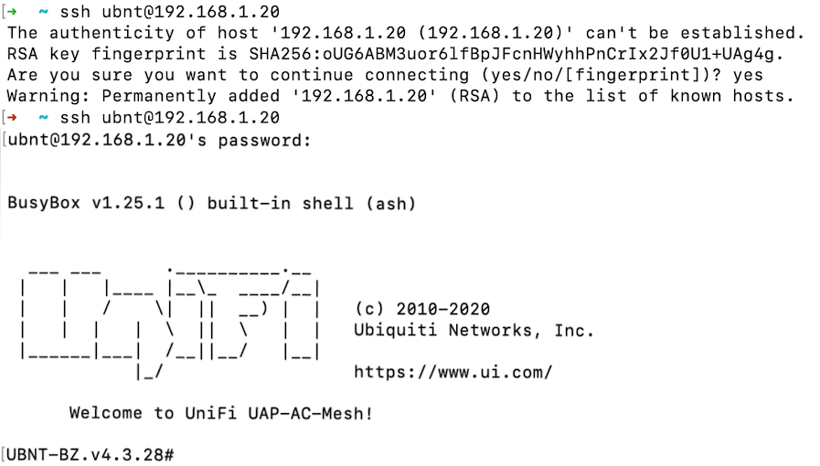

---

---
# Configurar AP Mesh

Esta guía lo guiará a través de la configuración de una malla de punto de acceso Ubiquiti para que pueda ser adoptada por la red PCW.

## Hardware requerido

* Unidad de malla AP: [Ubiquiti Mesh Dual-Band Access Point](https://store.ui.com/products/unifi-ac-mesh-ap) (antena Ubiquiti blanca con orejas de conejo)
* Inyector PoE
* Cable Ethernet
* Ordenador
* Adaptador Ethernet USB (si el ordenador no tiene puerto ethernet)
* Cable de regleta/alargador
* Paperclip

## Pasos de instalación

### Establecer IP estática en el equipo

Instrucciones para Mac (otros sistemas operativos por determinar)

1. Abra `System Preferences` > `Network`.
2. Seleccione la conexión Ethernet que tiene con la unidad de malla AP. 
3. Cambie el valor de `Configure IPv4` a `Manually`.
   
4. Establezca la dirección IP en `192.168.1.29` (aunque la mayoría de los valores deberían funcionar aquí).
5. Establezca la máscara de subred a `255.255.255.0`
   
6. Haga clic en `Apply`

### Conecte la unidad de malla AP.

1. Conecte el inyector PoE a una toma de corriente o a una regleta.
2. Conecte el puerto `POE` del inyector a la unidad de malla AP con un cable ethernet.
3. Conecte el puerto `LAN` del inyector al ordenador, utilizando el adaptador Ethernet USB si no dispone de un puerto Ethernet.
   
   

### Restablecimiento de fábrica de la unidad de malla AP.

Las unidades de malla AP han tenido un comportamiento inesperado incluso fuera de la caja, por lo que se recomienda reiniciarlas de fábrica antes de continuar.

1. Con el clip, pulse el botón de restablecimiento situado en la parte inferior de la unidad de malla AP hasta que haga clic.
2. Mantenga pulsado durante 15 segundos.
3. Una vez que la luz de estado de la unidad de malla AP ha destellado y se ha apagado, el dispositivo se ha restablecido.

### Conecte a la unidad de malla AP.

1. Abra un símbolo del sistema
2. Si se ha conectado previamente a una unidad de malla de AP, tendrá que editar el archivo de `known_hosts` , o obtendrá un error de`Host key verification failed` error.
   1. Abra `~/.ssh/known_hosts` con `vim`, `nano`, o el editor de texto que desee.
   2. Elimine la línea que comienza por `192.168.1.20` (tendrá un aspecto similar a `192.168.1.20 ssh-rsa AAAAB3NzaC1yc2E...`), y guarde el archivo.
3. Ejecute el comando `ssh ubnt@192.168.1.20`
4. Puede ver la alerta:

       The authenticity of host '192.168.1.20 (192.168.1.20)' can't be established.
       RSA key fingerprint is SHA256:oUG6ABM3uor6lfBpJFcnHWyhhPnCrIx2Jf0U1+UAg4g.
       Are you sure you want to continue connecting (yes/no/[fingerprint])?

   Presione sí para continuar.
5. Cuando se le solicite la contraseña, escriba `ubnt`.
6. Ahora debe estar conectado a la unidad de malla AP.
   

### Adopte AP Mesh Unit

Necesitará acceso al portal Philly Community Wireless HostiFi para completar este paso.

1. De su `ssh` , ejecute el comando `set-inform http://unifi.phillycommunitywireless.org:8080/inform`.
   * Esto alertará al controlador HostiFi de que la unidad de malla AP desea ser adoptada.
2. Abra el portal HostiFi en el explorador y desplácese a la lista de dispositivos.
3. La unidad de malla AP debe aparecer en la lista de dispositivos en espera de adopción.
4. Pulse `Adopt` para adoptar la unidad de malla AP.

## Solución de problemas

1. Computadora no reconoce la unidad de malla AP en la configuración de red o el comando`ssh` falla.
   * La unidad de malla AP puede tardar unos minutos en iniciarse después de enchufarla, por lo que espere hasta que la luz de estado se ilumine en blanco y vuelva a intentarlo.
2. ¿Qué significa este patrón de luces de estado?
   * [LED Color Patterns for UniFi Devices](https://help.ui.com/hc/en-us/articles/204910134-UniFi-LED-Color-Patterns-for-UniFi-Devices)
