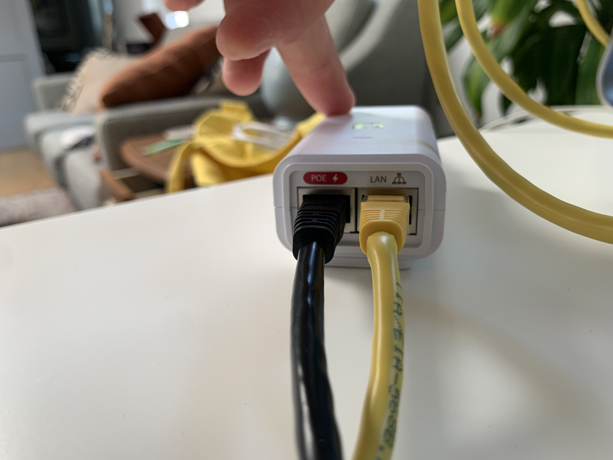
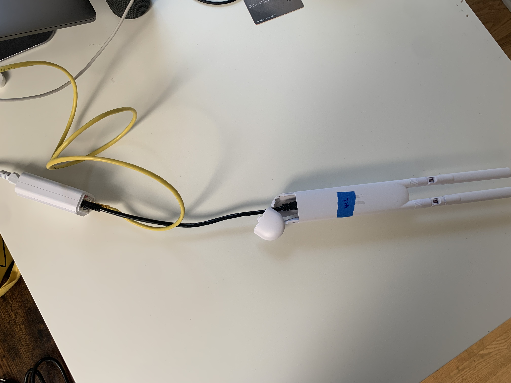

# Configuring Unifi APs (UAP-AC-M and UAP-AC-M-PRO)

This guide will walk you through configuring a Ubiquiti Access Point AC Mesh ("bunny ears"), which consists of a few steps:

* Connect the device to your computer, and make sure it has a route to the Internet
* Update the device's firmware to the latest stable version, 4.3.20
* Inform the device of the URL of our Unifi controller
* Adopt the device via the controller interface (requires permissions)

## You will need

| Item | Purpose |
| --- | --- |
| Unifi Access Point AC Mesh (white Ubiquiti antenna with bunny ears) | Unit to be configured |
| PoE injector (comes with AP) | Supplies power to the AP |
| 2 Ethernet cables | One powers AP, one provides data link to computer |
| USB Ethernet adapter | If your computer doesn't have an Ethernet port |
| Computer running MacOS or Linux | Perform remote configuration |
| Wall outlet |  |
| Paperclip (or other thin item) | Performing a factory reset |

## Setup Steps

### Wire it up

1. Plug the Power-over-Ethernet injector into an outlet, or power strip.
2. Connect the `POE` port of the injector to the AP Mesh Unit with an ethernet cable.
3. Connect the `LAN` port of the injector to your computer, using the USB Ethernet adapter if you don't have an Ethernet port.
   
   

### Factory reset AP

The AP Mesh Units have had unexpected behavior even out of the box, so it is recommended to factory reset it before continuing.

1. With the paperclip, press the reset button at the bottom of the AP Mesh Unit in until it clicks.
2. Hold it pressed in for 5 seconds.
3. The status light on the AP should flash, then go out as the device reboots. When it comes back on it should be solid white, indicating the reset was successful.

### Configure your computer's Ethernet settings

Follow the instructions here: [Setting a static IP for your computer](./static-ip.md)

### Connect to the AP using SSH

1. Open a command line prompt.
2. Run the command `ssh ubnt@192.168.1.20`
3. You may see the alert:

       The authenticity of host '192.168.1.20 (192.168.1.20)' can't be established.
       RSA key fingerprint is SHA256:oUG6ABM3uor6lfBpJFcnHWyhhPnCrIx2Jf0U1+UAg4g.
       Are you sure you want to continue connecting (yes/no/[fingerprint])?

   Press yes to continue.
4. When prompted for the password, enter `ubnt`.
5. You should now be connected to the AP Mesh Unit.
   

!!! info
    If you you get a `Host key verification failed` error, you'll need to edit your `known_hosts` file.

    1. Open `~/.ssh/known_hosts` with `vim`, `nano`, or the text editor of your choice.
    2. Remove the line beginning with `192.168.1.20` (It will look something like `192.168.1.20 ssh-rsa AAAAB3NzaC1yc2E...`), and save the file.

### Set the device firmware version

We use device firmware version 4.3.20, [on the advice of the good people at NYCMesh](https://docs.nycmesh.net/hardware/unifi-ap/).

1. The device firmware is available under "UniFi firmware 4.3.20" on [this page](https://www.ui.com/download/unifi/unifi-mesh/uap-ac-m/unifi-firmware-4320-uap-ac-litelrproedumm-proiwiw-pro). Click "Download", "I accept", and then "Copy URL". Alternatively, just copy the URL here: `https://dl.ui.com/unifi/firmware/U7PG2/4.3.20.11298/BZ.qca956x.v4.3.20.11298.200704.1347.bin`
2. While connected to the device via SSH, type `upgrade https://dl.ui.com/unifi/firmware/U7PG2/4.3.20.11298/BZ.qca956x.v4.3.20.11298.200704.1347.bin`
3. You will be disconnected from the device. Wait until it reboots (you can `ping` the IP address to test if it's up, or just try SSHing), then SSH back in.

### Adopt AP Mesh Unit

You will need access to the Philly Community Wireless HostiFi portal to complete this step.

1. From your `ssh` shell, run the command `set-inform http://unifi.phillycommunitywireless.org:8080/inform`.
   * This will alert the HostiFi controller that the AP Mesh Unit wants to be adopted.
2. Open the HostiFi portal in your browser, and navigate to the device list.
3. The AP Mesh Unit should appear in the list of devices awaiting adoption.
4. Press `Adopt` to adopt the AP Mesh Unit.

## Troubleshooting

1. Computer doesn't recognize AP Mesh Unit in Network settings, or `ssh` command fails.
   * The AP Mesh Unit can take a few minutes to boot after being plugged in, so wait until the status light is solid white and try again.
2. What does this status light pattern mean?
   * [LED Color Patterns for UniFi Devices](https://help.ui.com/hc/en-us/articles/204910134-UniFi-LED-Color-Patterns-for-UniFi-Devices)