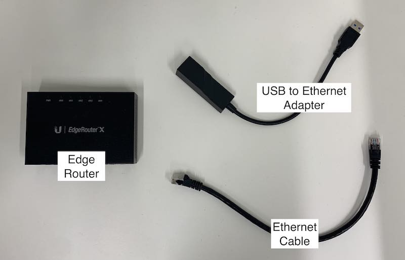
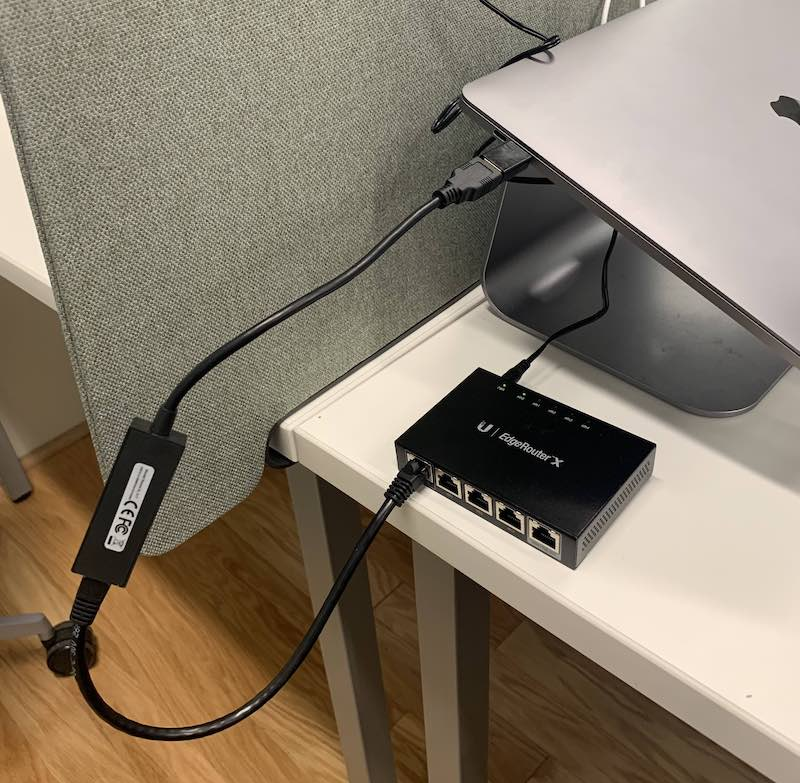
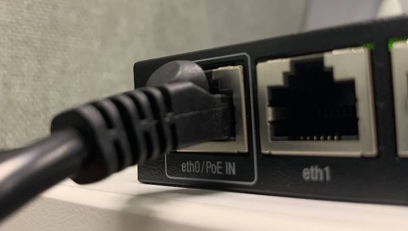
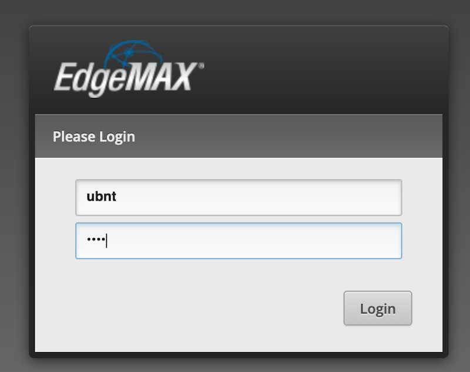
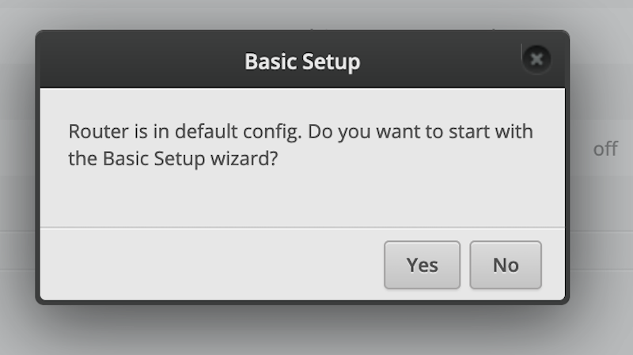

# Configure EdgeRouter X

This guide will walk you through configuring a Ubiquiti EdgeRouter X.

## Required Hardware

- [ERX Router](https://store.ui.com/collections/operator-edgemax-routers/products/edgerouter-x) and power cable
- Ethernet cable
- Computer
- USB Ethernet adapter (if computer doesn't have ethernet port)

## Setup Steps

### Wire up ERX

1. Plug the ERX into its power cable, and plug the power cable into an outlet.
2. Connect the `eth0` port of the ERX to your computer with an Ethernet cable, using the USB Ethernet adapter if you don't have an Ethernet port.

### Configure your network settings

Follow the instructions here: [Setting a static IP for your computer](./static-ip.md)

### Configure ER-X using Wizard

1. Navigate to the portal at [https://192.168.1.1](https://192.168.1.1) in your browser
2. Log into the portal with username `ubnt`, password `ubnt`.
   
4. On the `Use wizard?` prompt, press yes.
   
5. If the prompt doesn't appear, navigate to the Wizard tab.
7. Change the Port from eth0 to eth4. This configures the port to serve as the WAN for the Litebeam antenna. 
8. Leave other settings unchaged. Only Use One LAN should be checked.
9. Under User Setup create a new user and set the PCW username and password.
10. Then press Apply and follow the instructions to Reboot the device.
11. Now return to the portal and log in with the PCW username and password (contact project maintainers for this info).
12. To verify WAN is set to eth4, visit the Firewall/Nat section.
13. Under the NAT tab, see if Masquerade is set to eth4 for the WAN masquerade.
14. Under the Dashboard, click on Actions for eth4 to turn on POE.
15. Click on the System tab at the bottom left of the console.
16. Input the host name for the device.
17. Set up the address on DNS to be 1.1.1.1.

To double check if a device is properly configured, check the settings under the Dashboard and System tabs.

### Configure ER-X using Config File

1. Download the [ERX config file](../assets/configs/erx-config.tar.gz)
2. Navigate to the portal at [https://192.168.1.1](https://192.168.1.1) in your browser
3. Log into the portal with username `ubnt`, password `ubnt` as above.
4. On the `Use wizard?` prompt, press no.
5. Press the `System` tab on the bottom of the page.
6. Under the `Restore Config` section, press `Upload a file` and select the ERX config file you downloaded.
   
7. The ERX will reboot using the new configuration.
8. That's it! If you need to do more configuration, you can log back into the portal using the PCW username and password.

## Installation Setup

When installing the devices at a house, remember the typical setup is:

1. eth0 serves as the passthrough for POE from an adaptor plugged into an outlet
2. eth1 serves for the LAN port of the adapter powering the first PCW AP
3. eth2-3 can serve for wired connections to additional APs, each of which need to be powered through POE adaptors.
4. eth4  serves as the WAN port with passthrough POE to communicate and provide power to the rooftop Litebeam. 
   
