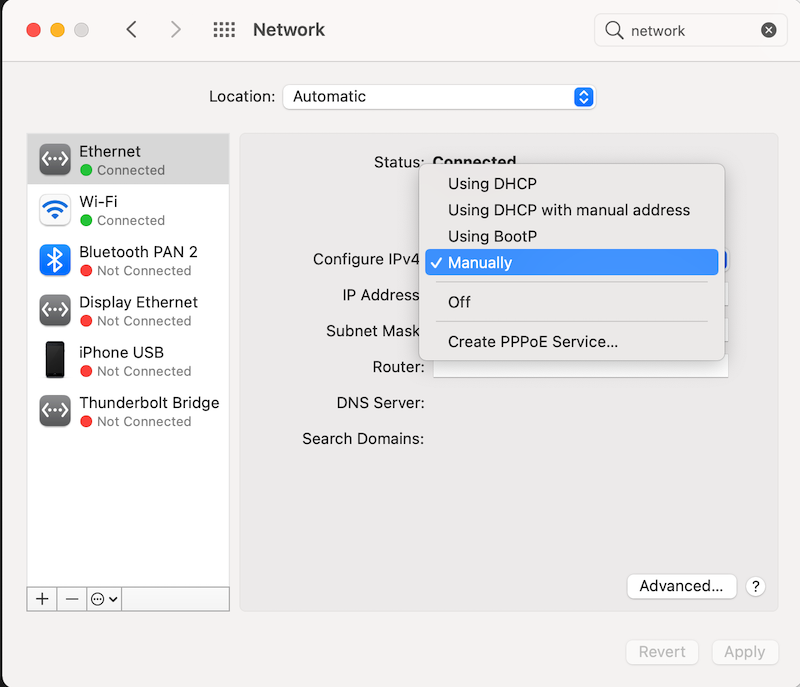
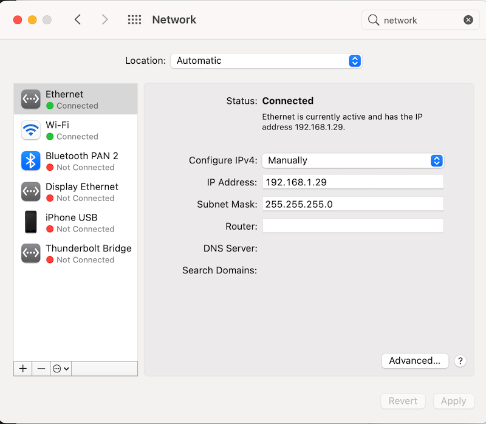

---

---
# Setting a static IP

This article contains instructions for setting your computer's Ethernet adapter to use a static IP address on the 192.168.1.\* subnet. This is a necessary step for completing the connection steps outlined in our config instructions for the [EdgeRouter X](../configure-erx) and the [Mesh AP](../configure-ap-mesh).

Choose your computer's OS:

[MacOS](#macos)  
[Ubuntu](#ubuntu)  
Windows (_TBD_)

## MacOS

1. Open up `System Preferences` > `Network`.
2. Select the Ethernet connection you have with the device you'd like to configure.
   
3. Change the value of `Configure IPv4` to `Manually`.
   
4. Set the IP Address to `192.168.1.2`.
5. Set the Subnet Mask to `255.255.255.0`
   
6. Click `Apply`

## Ubuntu

_These instructions have only been tested on Ubuntu 20.04._

1. Open your `Settings` > `Network`.
2. Under the "wired" section, click the plus sign to create a new settings profile. Name the profile "Static IP" or whatever you want.
   
3. In the **IPv4** tab, choose "Manual".
4. Set the Address field to `192.168.1.2`  
5. Set the Netmask to: `255.255.255.0`  
   (Leave Gateway empty, and DNS/Routes on `Automatic)
   
5. Click "add"; you should see the profile appear in your settings. Select it when connected to activate the static IP configuration.

## Details

These steps use `192.168.1.2` as the static IP, but it can be anything within the `192.168.1.0/24` range (`.0-.255`) except for `.0` (network), `.1` (gateway), `.20` (the mesh AP's default IP), and `.255` (broadcast).