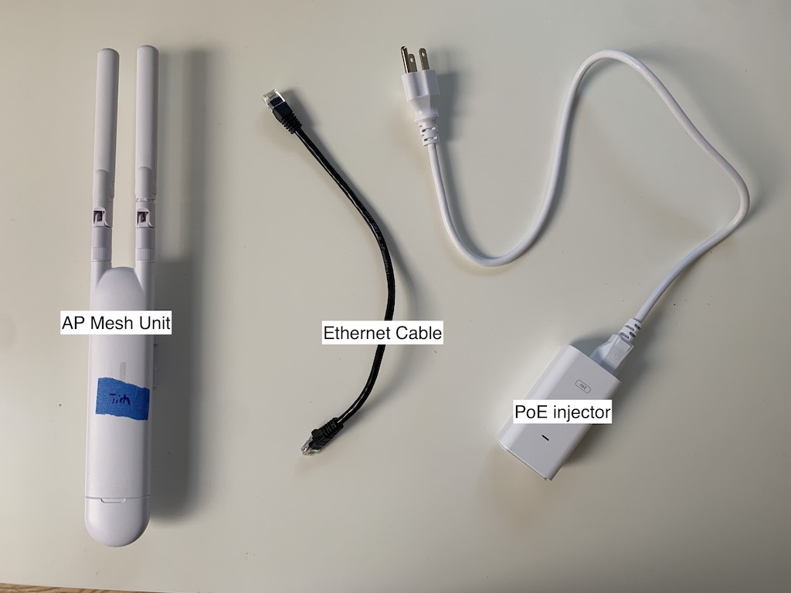
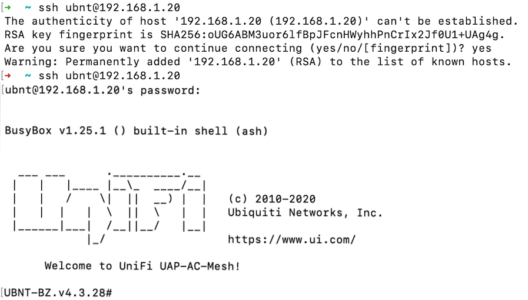

# Configuring Unifi APs (UAP-AC-M and UAP-AC-M-PRO)

This guide will walk you through configuring a Ubiquiti Access Point AC Mesh ("bunny ears"), which consists of the following steps:

- Power and factory reset the Unifi AP AC Mesh
- Connect the device to your computer, and make sure it has a route to the Internet
- Identify AP's IP address and `ssh` to connect to the device: `ssh ubnt@192.168.1.20`
- Inform the device of the URL of our Unifi controller: `sudo set-inform http://unifi.phillycommunitywireless.org:8080/inform`
- Adopt the device via the controller interface
- Configure the device and update the device's firmware

## You will need

| Item                                         | Purpose                                           |
| -------------------------------------------- | ------------------------------------------------- |
| Unifi Access Point                           | Unit to be configured                             |
| Power-over-Ethernet injector (comes with AP) | Supplies power to the AP                          |
| 2 Ethernet cables                            | One powers AP, one provides data link to computer |
| USB Ethernet adapter                         | If your computer doesn't have an Ethernet port    |
| Computer running MacOS or Linux              | Perform remote configuration                      |
| Wall outlet                                  |                                                   |
| Paperclip (or other thin item)               | Performing a factory reset                        |

## Setup Steps

### 1. Power the device and Factory Reset

1. Plug the PoE injector into an outlet, or power strip.
2. Connect the `POE` port of the injector to the AP Mesh Unit with an ethernet cable. You should see a white light turn on.

!!! info ""

    The light will be blue if the device has an existing configuration. Don't worry, we'll factory reset the device next.

The AP Mesh Units have had unexpected behavior even out of the box, so it is recommended to factory reset it before continuing.

1. With the paperclip, press the reset button at the bottom of the AP Mesh Unit in until it clicks.
2. Hold it pressed in for 5 seconds.
3. The status light on the AP should flash, then go out as the device reboots. When it comes back on it should be solid white, indicating the reset was successful. 
4. For more info on the status lights, refer to [LED Color Patterns for UniFi Devices](/Device-Configuration/troubleshooting-devices#unifi-ap-led-status-indicators)

Note: The AP Mesh Unit can take a few minutes to boot after being plugged in or reset, so wait until the status light is solid white,.

### 2. Connect the AP to your computer

We need to connect the device to our computer and determine its IP address, while also making sure it also has a route to the Internet. 

!!! info ""
    Normally, any device on your network will recieve an IP address via the Dynamic Host Configuration Protocol, or DHCP. This ensures that your router knows which device it is communicating with on your network. Although Unifi APs reset to `192.168.1.20`, if the AP has already been configured it may recieve a different IP address. 

The Unifi mesh APs should automatically reset to `192.168.1.20` so you can first try Step 2 and see if the `ssh` command works. 

If the mesh AP's IP address isn't `192.168.1.20`, there are two ways to find the IP address: 

<ol type="a">
  <li>Connect to local router </li>
  <li>Connect to your computer</li>
</ol>

We usually do option b) connect the AP directly to our computer.

#### 2a) If you have physical access to your WiFi router

1. Plug the `LAN` port of the PoE injector directly into an Ethernet port on your router. 
2. The AP will get the IP address `192.168.1.20` from your router. [Skip to the SSH step](#connect-to-the-ap-using-ssh).

#### 2b) If you don't have access to your router

1. Connect the `LAN` port of the injector to your computer, using the USB Ethernet adapter if you don't have an Ethernet port.
2. Make sure your computer is connected to WiFi.
3. Your computer's IP address must be Static in order for you to see and `ssh` into the AP.
5. Follow the instructions here: [Setting a static IP for your computer](./static-ip.md) to set your IP address.
6. You can also follow the directions on [Sharing a WiFi connection over Ethernet](shared-connection.md) to share your computer's wireless connection with the AP.
7. To find the AP's ip address, or if the SSH hangs, try running `arp -a` to find the AP.

### 3. Connect to the AP using SSH

!!! info ""
    `ssh`, or Secure Shell, is a protocol used for securing communications over a network using public key cryptogrpahy. We use `ssh` to connect to APs via the command line to configure and adopt APs.  

1. At the terminal, run the command `ssh ubnt@192.168.1.20` or replace the default IP address with the one you copied.
3. You may see "`The authenticity of host [...] can't be established`". Type "yes" and press Enter.
4. When prompted for the password, enter `ubnt`.
5. You should now be connected to the AP Mesh Unit.

   

!!! warning ""

    If you you get a `Host key verification failed` error, you'll need to edit your `known_hosts` file.
    1. The easiest way is to run the following command (at least on Ubuntu this works): `sudo ssh-keygen -f "/root/.ssh/known_hosts" -R "192.168.1.20"`
    1. Alternatively, ppen `~/.ssh/known_hosts` with `vim`, `nano`, or the text editor of your choice.
    2. Remove the line beginning with `192.168.1.20` (It will look something like `192.168.1.20 ssh-rsa AAAAB3NzaC1yc2E...`), and save the file.

### 4. Adopt AP Mesh Unit

!!! info "" 

    You will need access to the PCW Unifi controller interface to complete this step.

1. From your `ssh` shell, run the command `sudo set-inform http://unifi.phillycommunitywireless.org:8080/inform`. This will send a message over the internet to our controller, letting it know the device wants to be adopted.

!!! warning ""

    If your prompt hangs here, your AP probably doesn't have a route to the internet. [Return to the connection step](#connect-the-ap-to-your-computer) and make sure your setup follows those instructions.

2. Open the Unifi controller Hostifi portal in your browser, and navigate to the device list. The AP should appear in the list of devices awaiting adoption.
4. Press `Adopt` to adopt the AP Mesh Unit.
5. Adoption can take a while. Try refreshing the Hostifi portal and/or browser. 
6. You will be prompted to choose a Group for the AP. Choose All AP's and press save.
7. Go back to the main Dashboard to see if the device has been adopted.
8. If the device hangs during adopt, try to Forget it. Try the `set inform` command again.

### 5. Configure the AP and set the firmware version 

1. Change the settings to add your name and a number for each device you configure. The admin team will relabel devices upon install.
2. To upgrade firmware from within the controller, go to the device and open the Settings. Under Manage, find the Location URL field, and paste the link for the firmware version, then press Update.
    * URLs for firmware are available from [Unifi](https://ui.com/download/unifi) 

Further configurations of the device can be adjusted in the settings, but it is better to leave radio settings as default until installed on the network.

You can also set the firmware version while you are connected to the device through `ssh`:

1. While connected to the device via `ssh`, type `upgrade $url_to_firmware_version`
2. You will be disconnected from the device. Wait until it reboots and the light is solid white (you can `ping` the IP address to test if it's up, or just try SSHing), then `ssh` back in.
3. If it hangs, try canceling out and re-running the command
4. You can verify the firmware upgrade by looking at the header to your command line input, which provides the firmware version like "UBNT-BZ.v4.3.20#".

!!! warning ""

    The firmware upgrade tends to hang. We recommend upgrading firmware through the Unifi controller.
