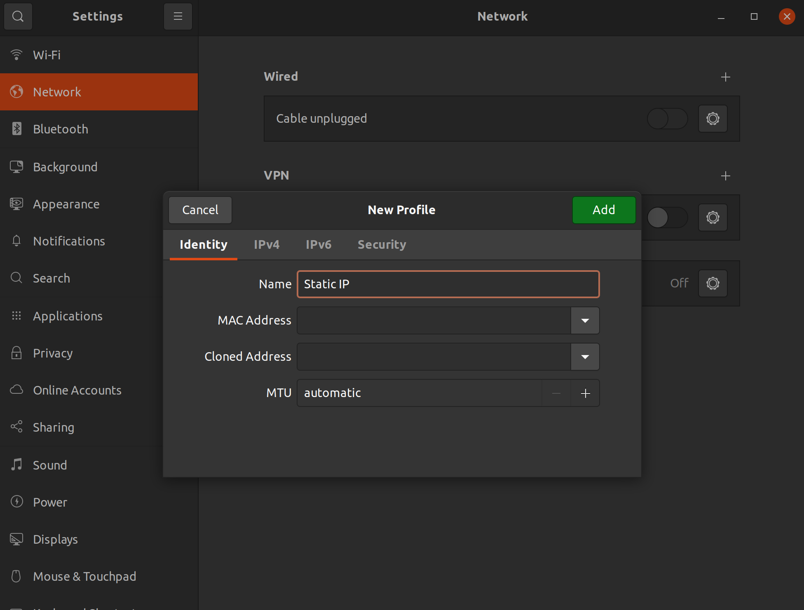

This page reviews how to configure your computer, to be able to connect to the networking devices. We review setting a static IP address and sharing internet with other computers. 

# Setting a static IP address
This section contains instructions for setting your computer's Ethernet adapter to use a static IP address on the 192.168.1.\* subnet. This is a necessary step for connecting to certain network devices via Ethernet, and is used in our config instructions for the [EdgeRouter X](../configure-erx) and the [Mesh AP](../configure-ap-mesh).

Choose your computer's OS:

* **[MacOS](#macos)**
* **[Ubuntu](#ubuntu)**
* **[Windows](#windows)**

## MacOS

1. Open up `System Preferences` > `Network`.
2. Select the Ethernet connection you have with the device you'd like to configure.
   
3. Change the value of `Configure IPv4` to `Manually`.
   
4. Set the IP Address to `192.168.1.2`.
5. Set the Subnet Mask to `255.255.255.0`
   
6. Click `Apply`

## Ubuntu

_These instructions have only been tested on Ubuntu 20.04._

1. Open your `Settings` > `Network`.
2. Under the "wired" section, click the plus sign to create a new settings profile. Name the profile "Static IP" or whatever you want.
   
3. In the **IPv4** tab, choose "Manual".
4. Set the Address field to `192.168.1.2`  
5. Set the Netmask to: `255.255.255.0`  
   (Leave Gateway empty, and DNS/Routes on \`Automatic)
   
6. Click "add"; you should see the profile appear in your settings. Select it when connected to activate the static IP configuration.

## Windows 

1. Open up `Network Connections` (type 'view network connections' into Windows Search)
2. Right-click the desired network adapter to open the context menu, then click 'Properties'
3. In the '(Adapter Name) Properties' menu, double-click on 'Internet Protocol Version 4 (TCP/IPv4)', or select it and then click 'Properties'. 
4. In the 'Internet Protocol Version 4 (TCP/IPv4) Properties' menu, select 'Use the following IP address':
5. Set the IP Address to `192.168.1.2`
6. Set the Subnet mask to `255.255.255.0`

7. Click `OK` 

## Details
These steps use `192.168.1.2` as the static IP, but it can be anything within the `192.168.1.0/24` range (`.0-.255`) except for `.0` (network), `.1` (gateway), `.20` (the mesh AP's default IP), and `.255` (broadcast).

# Sharing a WiFi connection over Ethernet
This section describes how to connect a device to your computer via Ethernet and share your computer's existing Internet connection with that device. In other words, your computer will be acting as a gateway and the connected device will be able to send packets via your computer to the Internet.

This is useful when you need a device to be able to access the internet while networked with your computer, but you do not have access to your router. We use it as an option in our config instructions for the [Unifi Mesh AP](../configure-ap-mesh).

Choose your computer's OS:

**[Ubuntu](#ubuntu)**  
**[MacOS](#macos)**  
**[Windows](#windows)**  

## Ubuntu
1.  Open your `Settings` > `Network`.

2.  Under the `Wired` section, click the plus sign to create a new settings profile. Name the profile "Shared" or whatever you want.

3.  In the **IPv4** tab, choose "Shared to other computers". Click Apply. Your computer should now be networked with the AP. 10.42.0.0/24 is the default subnet used by Ubuntu for this setup, but there's not necessarily a guarantee that your computer will use that subnet. If the next step returns no results, run `ip address` or `ifconfig` and look for the IP of your Ethernet interface (usually `eth0`) there.

4.  Open a terminal. Type the following to scan the devices in that IP range:

        nmap -sn 10.42.0.0/24 | grep report

    You should see two lines beginning with "`nmap scan report`". Find the line with an IP address that does not end with "`.1`", and copy that IP address.

If the nmap command hangs, you can also try the Mac OS directions on Ubuntu Linux and it should work fine.

## MacOS
_Begin these steps with the AP not connected to your computer via an ethernet port or adapter._

1.  Open `Sharing` from your `System Preferences` menu -> select `Internet Sharing` in the list on the left -> select the interfaces you want to enable sharing for -> click the box next to `Internet Sharing` to turn it on -> a warning dialog box will come up, so click `Start`.

2.  Run `arp -a | grep -v incomplete` to show a mapping of ip address to mac address for the devices on your network.

3.  Connect the ap to your machine or adapter and run `arp -a | grep -v incomplete` again. The difference between this and the previous grep output should be the AP. Note the IP address and MAC address.

4.  To confirm that the AP has a route to the internet, you can run the same commands as specified in step 5 of the Ubuntu instructions above (ssh, ping, etc.).

Note: These instructions were developed on a MacBook running Catalina, version 10.15.7.

## Windows 
*Begin these steps by connecting the AP to a PoE injector, and connecting the LAN port of the PoE injector to your computer's Ethernet port.*

1. Open the 'Settings' menu, and then click 'Network and Internet'  

2. Under 'Advanced Network Settings', click 'Change Adapter Options'

3. In the popup, right-click the interface you're connected through the Internet with (this will probably be 'Wifi' or 'Ethernet'), and then click 'Properties'

4. In the second popup, click the 'Sharing' tab.

5. Under 'Internet Connection Sharing', select 'Allow other network users to connect through this computer's Internet connection'. 

6. In the dropdown, select the interface that the AP/PoE injector is connected to. 

7. Click 'OK' 

8. Run `arp -a`, and check for the AP's MAC address in the ARP table. 

Note: these instructions were developed on Windows 10.