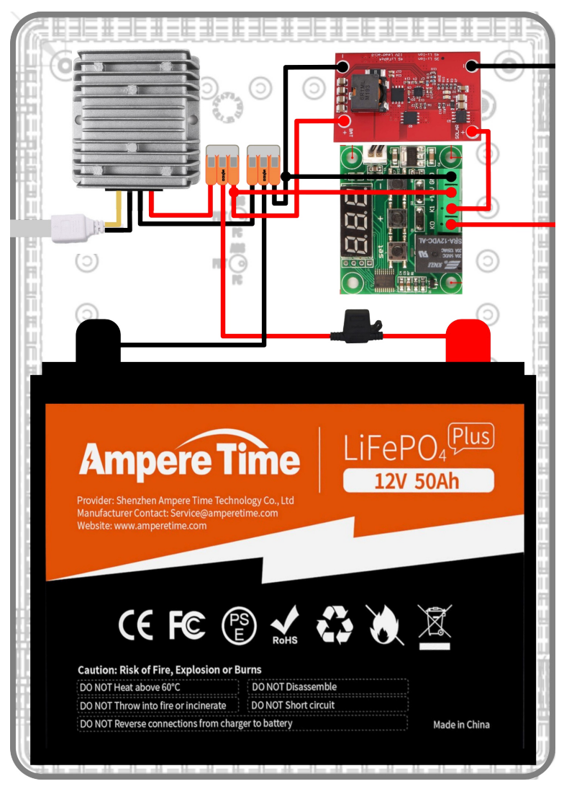
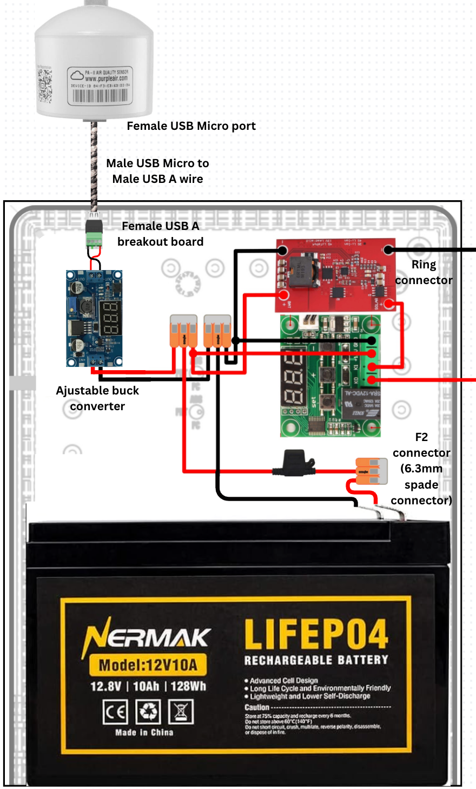
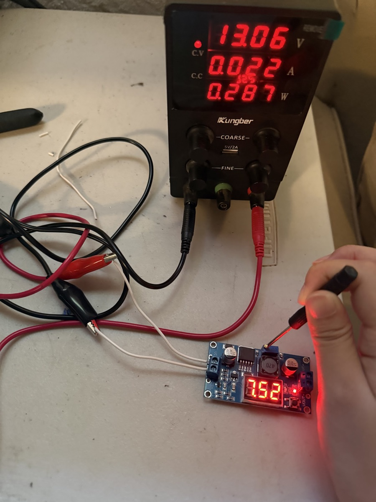
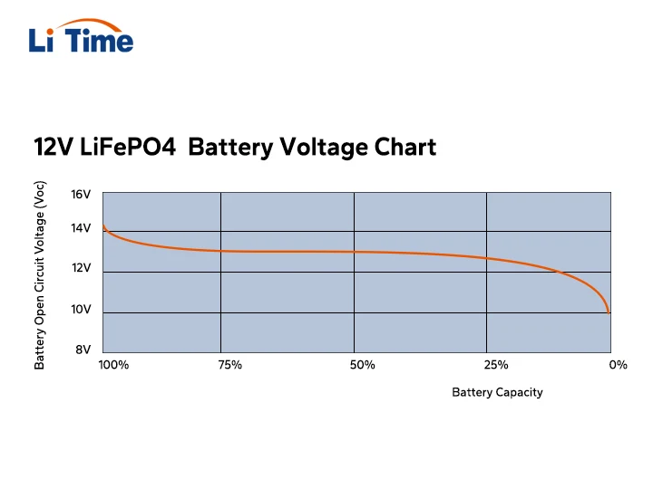
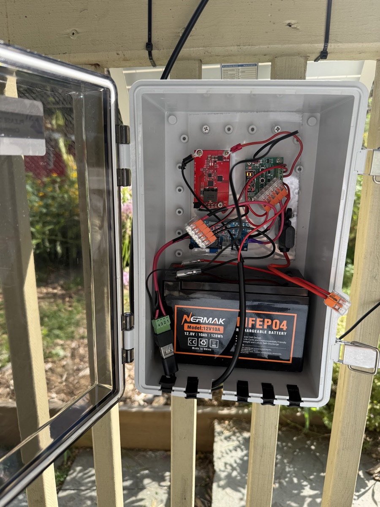
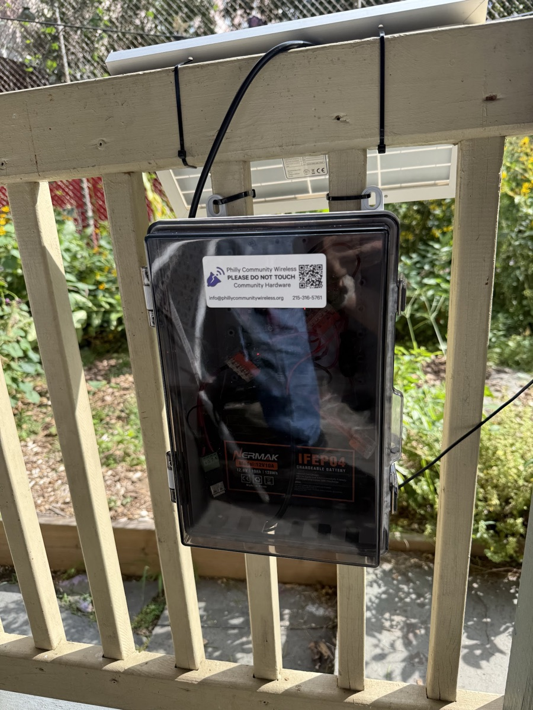
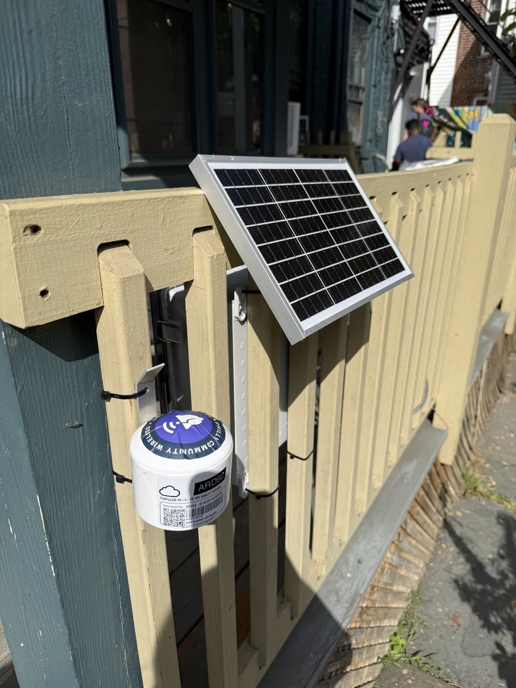
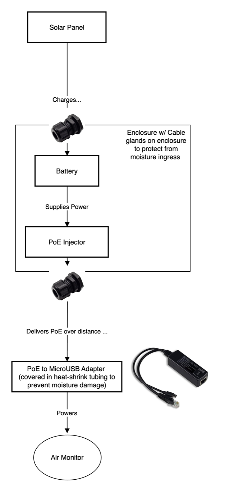

# Solar-Powered IoT Devices

Besides WiFi access points, Philly Community Wireless deploys small networked devices, mainly [PurpleAir air monitors](https://www.purpleair.com/products/classic-plus-air-quality-monitor) at green spaces around the city and [Meshtastic](https://meshtastic.org/) radio nodes. They run on 5V USB power and draw about a watt, but they still need a power source. PCW's existing air monitors (visible on the [PurpleAir map](https://map.purpleair.com/)) run off an outdoor, weatherproofed GFCI outlet, which rules out many sites that already have PCW internet. This page covers powering these devices from solar instead, with most of the detail on air monitors. For getting a device onto the network once it has power, see [Configure IoT Devices](../../for-network-users/configure-IoT.md).

The air monitor design below is a modified version of the [solar mesh node](solar-mesh-node.md) that powers a 5V PurpleAir monitor instead of a 24V mesh access point. It was developed by Amaris Chen, PCW's University of Pennsylvania intern, building on [Holobiont Lab's](https://holobiontlab.org/) meshbox.

## Power needs at a glance

| Device | Power input | Typical draw | Peak draw | Per day |
|---|---|---|---|---|
| PurpleAir air monitor | 5V, micro USB | 0.18A (~0.9W) ([PurpleAir](https://community.purpleair.com/t/how-much-power-does-a-purpleair-sensor-draw-and-how-much-bandwidth-data-does-it-use/847)) | 0.6A (3W) | ~21.6Wh |
| Meshtastic node (Heltec V3) | 5V, USB-C | ~0.15A (~0.75W), as reported by users | 0.25A (1.25W) | ~18Wh |

These are the devices' own draws. Whatever powers them (converters, displays, controllers) adds to this; see the [whole-box load](#load) below.

## Solar air monitor box

### From mesh node to air monitor

The Holobiont Lab box charges a 12V battery from a solar panel and boosts it to 24V for a Ubiquiti mesh access point ([Holobiont documentation](https://holobiontlab.org/docs/meshBoxDocumentation.pdf)). The air monitor version keeps the charge controller, temperature disconnect, fuse, and Wago connectors, swaps in a smaller battery, and replaces the 12V to 24V boost converter with a 12V to 5V [buck converter](https://en.wikipedia.org/wiki/Buck_converter) (a boost converter raises voltage; a buck converter lowers it) and a USB breakout for the monitor's power cable.

<figure style="display: flex; align-items: center; flex-direction: column;">
    
    <figcaption>Holobiont Lab design for powering a 24V Ubiquiti mesh node</figcaption>
</figure>

<figure style="display: flex; align-items: center; flex-direction: column;">
    
    <figcaption>Modified design for powering a 5V PurpleAir monitor</figcaption>
</figure>

### Parts list

| Part | What it does | What we used | Approx. cost |
|---|---|---|---|
| Weather-proof enclosure | Holds everything except the panel and monitor | [Joinfworld 11.4 x 7.5 x 5.5 in junction box](https://www.amazon.com/dp/B0D3DVQGZ9) | |
| Solar panel, 12V 10W | Charges the battery | [ECO-WORTHY 13.3 x 8.1 in, 10W](https://www.amazon.com/dp/B00OZC3X1C) | ~$29 |
| [MPPT](https://en.wikipedia.org/wiki/Maximum_power_point_tracking) charge controller | Converts the panel's output into the right voltage to charge the battery | 4A [BQ24650](https://www.ti.com/product/BQ24650) board, same as the solar mesh node ([review](https://www.beyondlogic.org/review-bq24650-5a-mppt-solar-controller-3s-4s-li-ion-lifepo4-12v-lead-acid/)) | |
| Low-temperature disconnect | Cuts the panel off below freezing, since LiFePO4 is damaged by charging in the cold | [XH-W1209](https://components101.com/modules/w1209-temperature-control-switch) thermostat board, same as the solar mesh node ([manual](../../../assets/files/solar/xh-w1209-thermostat-manual.pdf)) | |
| LiFePO4 battery, 12V 10Ah | Stores power for nights and cloudy days | [NERMAK 12V 10Ah](https://www.amazon.com/dp/B097BRKCQP) | ~$40 |
| In-line fuse holder + 2-3A fuse | Protects against a short | [18 AWG in-line fuse holders](https://www.amazon.com/dp/B0DT4NCD5V) (Holobiont boxes come with one) | ~$7.50 for five |
| F2 (6.3mm spade) crimp terminals | Connect wires to the battery's F2 terminals | [16 AWG spade terminals](https://www.amazon.com/dp/B09CYQLG49) | ~$13 for thirty |
| WAGO lever nuts | Join wires without soldering, easy to take apart | Same as the solar mesh node | |
| Adjustable buck converter | Steps 12V down to 5V | [DFRobot DFR0379](https://www.dfrobot.com/product-1552.html) | ~$5 |
| Female USB A breakout board | Turns the USB cable into screw terminals | [USB A breakout with screw terminals](https://www.amazon.com/dp/B0GXJ3NJJM) | |
| Micro USB to USB A cable | Carries power to the monitor | | |
| PurpleAir monitor | The load | [PurpleAir Classic Plus](https://www.purpleair.com/products/classic-plus-air-quality-monitor) | ~$239 |

PCW also has one [ECO-WORTHY 12V 20Ah](https://www.amazon.com/dp/B09NB97XGL) battery (~$73, screw terminals) on hand.

### Load

According to [PurpleAir](https://community.purpleair.com/t/how-much-power-does-a-purpleair-sensor-draw-and-how-much-bandwidth-data-does-it-use/847), the air monitors require 5V x 0.18A (~0.9W) to power continuously. This is about 21.6Wh per day, assuming continuous amperage. PurpleAir's [spec sheet](https://www.purpleair.com/products/classic-plus-air-quality-monitor) also lists short peaks of up to 600mA (3W), which the buck converter and cable need to handle.

PurpleAir [says](https://community.purpleair.com/t/purpleair-classic-minimum-input-voltage/9823) the sensors need a full 5V and a quality cable to run reliably; below that they start to misbehave. Voltage drops along a long or thin cable, so check the voltage at the monitor end, not just at the buck converter.

The PurpleAir air monitors have female micro USB ports for power. We use a male micro USB to male USB A cord, and so we need a female USB A breakout board with screw-in pins to split into positive and negative wire terminals.

Existing air monitors' exposed micro USB connections are not water-proof, but PCW has not encountered any issues regarding that. Nonetheless, we may consider sealing the connection with liquid electrical tape.

The 21.6Wh figure is the monitor alone. The box also powers itself around the clock, so size the battery and panel for the whole box:

| Draw | Current at 12.8V | Per day |
|---|---|---|
| PurpleAir, after the buck converter's ~12% loss | ~80mA | ~24.5Wh |
| Low-temperature disconnect (XH-W1209): display always on, plus its relay | 35mA idle, 65mA with the relay on ([spec](https://components101.com/modules/w1209-temperature-control-switch)) | ~11-20Wh |
| Buck converter's display, charge controller | small, not measured | |
| **Total** | | **~36-45Wh** |

With the settings in [Assembly](#assembly), the disconnect's relay stays on whenever it is warmer than the cutoff, which is most of the year, so expect the high end. A battery with a built-in low-temperature charge cutoff would remove the XH-W1209 and its draw entirely. To get the real figure for a box, measure the current at the battery with and without the monitor plugged in.

### Buck converter

We use the adjustable [DFR0379 buck converter](https://www.digikey.com/en/products/detail/dfrobot/DFR0379/7087190) available at UPenn's Detkin Lab. Its [LM2596](https://www.onsemi.com/pdf/datasheet/lm2596-d.pdf) chip has an average efficiency of 88%.

Notice that there is a button and an LED segment display on board. The display will show the detected input or output voltage, with a red LED lighting up on the corresponding side. The button switches between displaying input and output.

Before connecting the buck converter to the system, make sure that the output voltage is at 5V. This can be tested by inputting a 12-13V voltage from an external power supply. Black clip on IN- and red on IN+. Next, check the output voltage on the display. You can tune the output voltage by turning the tiny screw on the [trimpot](https://en.wikipedia.org/wiki/Trimmer_(electronics)) (CCW to decrease).

<figure style="display: flex; align-items: center; flex-direction: column;">
    
    <figcaption>In the process of tuning the trimpot</figcaption>
</figure>

### Battery

[LiFePO4](https://en.wikipedia.org/wiki/Lithium_iron_phosphate_battery) (lithium iron phosphate) batteries are preferred over LiPo because LiFePO4 batteries are [less prone to overheating, have a longer cycle life, and are more environmentally friendly](https://www.grepow.com/blog/lifepo4-vs-lipo-what-is-the-difference.html). Typically 4-cell LiFePO4 batteries have a nominal voltage of 12.8V (see graph below for voltage at different battery life percentages).

<figure style="display: flex; align-items: center; flex-direction: column;">
    
    <figcaption>12V LiFePO4 voltage by remaining capacity (<a href="https://www.litime.com/blogs/blogs/lithium-battery-voltage-chart">source</a>)</figcaption>
</figure>

For the box to last 3 days without sunlight at the [whole-box load](#load) of ~36-45Wh a day, the battery needs about 8.5-10.5Ah, and more in practice, since the BMS shuts the battery off before it is truly empty. The 10Ah battery we used has little margin; the 20Ah battery PCW has on hand would give about six days.

The box uses the same temperature disconnect as Holobiont Lab's design, but if the battery's [BMS](https://en.wikipedia.org/wiki/Battery_management_system) (battery management system) has a low-temperature charge cutoff, the temperature disconnect will not be needed. An internal BMS also protects the battery from overcharge, over-discharge, over-current and short circuit. Almost every LiFePO4 battery has a BMS, but most cheaper ones do not cut off charging in the cold, so check the listing for that specifically.

Some batteries that may work:

* ~$73 12V 20Ah 6.7"x7.2"x3" Screw Terminal BMS [ECO-WORTHY](https://www.amazon.com/dp/B09NB97XGL)
* ~$40 12V 10Ah 5.9"x2.6"x3.7" F2 Terminal BMS [NERMAK](https://www.amazon.com/dp/B097BRKCQP)

### Battery safety

The internal BMS can trip at low voltage, after which the battery terminals read 0V. This is called a sleeping battery; see [how to wake up a sleeping LiFePO4 battery](https://www.batteriesplus.com/blog/power/waking-up-a-lifepo4). In short: charge it at 14.6V and ~1A for our battery. During the Holobiont visit we charged at 1A, then 3A, then 5A.

The Holobiont Lab design includes a fuse holder near the positive terminal of the battery to prevent overcurrent, which can be caused by a short in the system. The fuse holder with a ring connector end may be transferred to the modified set up for screw terminal batteries. For F2 terminals, fuse holders and female F2 connectors may be purchased:

* ~$7.50 [Five 18 AWG In-Line Fuse Holders](https://www.amazon.com/dp/B0DT4NCD5V)
* ~$13 [Thirty 16 AWG 6.3mm Spade (F2) Crimp Terminals](https://www.amazon.com/dp/B09CYQLG49)

As an estimate, the max possible current through the battery is 10W / 12V = 0.83A. Fuses rated between 2-3A are some reasonable choices.

To keep the system off for troubleshooting or otherwise, disconnect the power wire from the Wago.

### Solar panel

Pennsylvania [averages about 4 peak sun hours a day](https://www.portable-sun.com/blogs/news/peak-sunlight-hours) over the year ("peak sun hours" means the day's sunlight expressed as hours of full-strength sun). Size the panel for December, though, not the average. [Voltaic Systems](https://blog.voltaicsystems.com/power-purple-air-quality-monitor-from-solar/), who tested solar setups for PurpleAir monitors, use about 2.2 sun hours a day for a south-facing panel in New York in December, a close match for Philadelphia. At the [whole-box load](#load) of ~36-45Wh a day and about 20% losses (wiring, charge controller, heat, dirt), that works out to 36 / 2.2 / 0.8 = ~20W up to ~26W. Voltaic recommends a 20W panel for one monitor, and Holobiont's rule of thumb is to add 40% or more to a panel's rated wattage, since panels always produce less than rated.

The 10W panel on the first box makes only about 18Wh on a December day, less than the monitor alone uses, and about 32Wh on a clear September day, still short of the whole box.

Moreover, the voltage of the panel should be greater than the voltage of the battery for current to flow into the battery. A panel sold as "12V" actually puts out around 18V at its peak, which is what lets it charge a 12.8V battery.

This means that the [~$18 11.8"x6.8" 5V 5W USB C solar panel](https://www.amazon.com/dp/B0CR3X8PF7) previously suggested is not good enough for the air monitor, though it has the ideal dimensions. The 12V 10W panels we compared are below; the same makers sell 20W and larger versions, which are the better choice for a box that runs through winter.

* ~$22 14.9"x7.8" 12V 10W [Futuresolar](https://www.amazon.com/dp/B0F8Q4TJPR)
* ~$26 17.3"x8.5" 12V 10W [Newpowa](https://www.amazon.com/dp/B00W80N8TA)
* ~$29 13.3"x8.1" 12V 10W [ECO-WORTHY](https://www.amazon.com/dp/B00OZC3X1C) (the one we use)

### Assembly

Build and test the box on a workbench before taking it out. Holobiont Lab's [meshbox documentation](https://holobiontlab.org/docs/meshBoxDocumentation.pdf) walks through the same parts one at a time.

1. Tune the buck converter to 5V before it goes in the box; see [Buck converter](#buck-converter).
2. Program the XH-W1209 low-temperature disconnect. Hold SET for 5 seconds to enter programming mode, use + and - to move through the settings, and SET to change one. Holobiont's settings are P0 (mode) C, P1 (hysteresis) 2, P2 (upper limit) 55°C, P3 (lower limit) 2°C, P4 (calibration) 0, P5 (start delay) 0 and P6 (high-temperature alarm) off. Boxes from Holobiont come already programmed. See the [manual](../../../assets/files/solar/xh-w1209-thermostat-manual.pdf) for more.
3. Crimp F2 spade terminals onto the battery leads (for an F2-terminal battery like the NERMAK), and fit the in-line fuse holder on the positive lead, close to the battery. [6 steps to crimp ring terminals](https://wesbellwireandcable.com/blog/6-steps-to-crimp-ring-terminals-like-a-pro-copper-hook-up-wire-or-lead-wire/) covers the technique.
4. Mount the charge controller, temperature disconnect and buck converter on a backing plate inside the enclosure (Holobiont uses a fiberglass sheet), and attach any heatsinks with [thermal tape](https://www.amazon.com/s?k=thermal+tape+for+heat+sink).
5. Wire everything through the Wago lever nuts, following the [wiring diagram](#from-mesh-node-to-air-monitor). The XH-W1209's first two terminals (its relay) go between the panel's positive wire and the charge controller's solar input; its other two take 12V power from the battery side. Tape its temperature probe to the side of the battery. The buck converter's output goes to the USB breakout's screw terminals.
6. Connect the battery first, then the panel, then the monitor, and disconnect in the reverse order. This is the usual rule for solar charge controllers, since the battery powers the controller.
7. Before closing the box, press the buck converter's button to check both sides: the input should read the battery voltage (about 13V when charged) and the output 5V. Then plug in the monitor and check that it powers on.
8. On site, face the panel south, unshaded, tilted at about the site's latitude (roughly 40° in Philadelphia). Bring cables into the enclosure through cable glands to keep water out. The EPA's [guide to siting air sensors](https://www.epa.gov/air-sensor-toolbox/guide-siting-and-installing-air-sensors) covers where the monitor itself should go.

### Deployment

    
    
    

#### First deployment (September 2026)

The first box ran for three days before the monitor went offline. The battery had dropped to 10-11V (read on the buck converter's display), and its BMS then put it to sleep. A full 10Ah battery holds about 128Wh, enough for about five days of the monitor alone, so the box was drawing much more than planned. The [whole-box load](#load) of ~36-45Wh a day is more than a 10W panel makes even on a clear September day (about 32Wh after losses), so any shade or cloud puts the battery into steady decline. The battery was recharged and the box left running without the monitor to rule out a charging fault. The next version should use a larger panel and battery (see [Solar panel](#solar-panel) and [Design alternatives](#design-alternatives)).

### Troubleshooting

* When the input voltage is 13.0V and the solar panel has been exposed under direct sunlight for ~20-30 minutes, we empirically observe the input voltage rise to 13.1V. This can be used to verify if the solar panel is working properly during that instance of time.
* The buck converter's display doubles as a battery voltmeter: press the button to switch it to input voltage. Compare against the [voltage curve](#battery) to estimate how much charge is left.
* If the battery reads 0V, the BMS has put it to sleep; see [Battery safety](#battery-safety).
* To keep the system off, disconnect the power wire from the Wago.
* Check the fuse for continuity. A blown fuse points to a short during maintenance or a wiring mistake.
* Check the low-temperature disconnect: is its display on, and is it near or below freezing? If so, the panel is deliberately cut off and the battery will not charge.
* Measure the panel voltage at the charge controller input in daylight. It should be well above the battery voltage (around 18V for a "12V" panel); if not, check the panel wiring.

These checks are adapted from the troubleshooting section of Holobiont Lab's [meshbox documentation](https://holobiontlab.org/docs/meshBoxDocumentation.pdf). See also the troubleshooting section of [Solar Mesh Nodes](solar-mesh-node.md#troubleshooting-solar-mesh-nodes), which covers the shared parts of the box.

### Design alternatives

Options worth considering for the next version, especially if PCW builds more of these:

* A 20W panel instead of 10W, for more margin in winter
* A battery with a built-in low-temperature charge cutoff, to drop the XH-W1209 and its constant draw (see the [load table](#load))
* A PWM solar charge controller with built-in 5V USB outputs (about $17), which would replace the MPPT board, buck converter and USB breakout in one part
* A 12V USB charger made for cars or boats in place of the buck converter and breakout board, which is easier for non-technical volunteers to swap out
* Powering the monitor from an existing solar mesh node instead of its own box, or over PoE (see [below](#powering-iot-devices-over-poe))
* [18650](https://en.wikipedia.org/wiki/18650_battery) cells, salvaged from e-bike batteries or cold-weather rated, though LiFePO4 remains the safer choice. [Battery Hookup](https://batteryhookup.com) in Bensalem sells surplus cells.

## Meshtastic nodes

PCW's Meshtastic nodes are Heltec V3 boards (from Iffy Books), built on an ESP32 chip and powered at 5V over USB-C. Users report an average draw of about 0.15A with peaks around 0.25A (1.25W), a little less than an air monitor. A small 5V 5W USB panel can't power one directly: output drops to nothing at night and sags on cloudy days, and the same goes for air monitors. Either way the device needs a battery between it and the panel.

Options Holobiont Lab suggested for Meshtastic specifically:

* Off-the-shelf solar chargers made for USB-powered Meshtastic devices, such as the [YetiWurks solar charger](https://www.yetiwurks.com/product/solar/), which Holobiont has run for a couple of years. It has a protection board but no documented low-temperature disconnect; Holobiont has read of units running for years unmaintained in North Dakota and Minnesota.
* Projects that repurpose the internals of solar lights, such as the [Meshtastic Harbor Breeze solar node](https://www.instructables.com/Meshtastic-Harbor-Breeze-Solar-Node/)
* ESP32 boards with a built-in solar input for charging 18650 cells

## Powering IoT devices over PoE

Where a site already has power and a PCW install, an air monitor can instead be powered over Ethernet: a PoE switch or injector sends power down the cable, and a PoE splitter at the far end steps it down to 5V micro USB (or USB-C for a Meshtastic node). The adapter at the monitor end needs heat-shrink tubing to keep moisture out. The same approach can run a monitor off a solar box's battery through a PoE injector, as in the sketch below ([editable source](../../../assets/files/solar/air-monitor-solar-poe.drawio), opens in [diagrams.net](https://app.diagrams.net/)).

<figure style="display: flex; align-items: center; flex-direction: column;">
    
    <figcaption>Powering an air monitor from a solar box over PoE (PCW sketch, 2025)</figcaption>
</figure>
## Further resources

* [Holobiont Lab meshbox documentation](https://holobiontlab.org/docs/meshBoxDocumentation.pdf) ([PCW's copy](../../../assets/files/solar/holobiont-meshbox-documentation.pdf), in case that link moves)
* [XH-W1209 thermostat manual](../../../assets/files/solar/xh-w1209-thermostat-manual.pdf), the vendor's sheet for the low-temperature disconnect
* [Power PurpleAir Quality Monitor From Solar](https://blog.voltaicsystems.com/power-purple-air-quality-monitor-from-solar/), Voltaic Systems' tested sizing for the same monitor
* PurpleAir community: [power and data use](https://community.purpleair.com/t/how-much-power-does-a-purpleair-sensor-draw-and-how-much-bandwidth-data-does-it-use/847) and [running off the grid](https://community.purpleair.com/t/off-the-grid/119)
* EPA: [guide to siting and installing air sensors](https://www.epa.gov/air-sensor-toolbox/guide-siting-and-installing-air-sensors)
* [More on the MPPT solar controller](https://www.beyondlogic.org/review-bq24650-5a-mppt-solar-controller-3s-4s-li-ion-lifepo4-12v-lead-acid/)
* [6 steps to crimp ring terminals](https://wesbellwireandcable.com/blog/6-steps-to-crimp-ring-terminals-like-a-pro-copper-hook-up-wire-or-lead-wire/)
* [Green Technology Resources](green-technology.md), including environmental monitoring programs in Philadelphia
