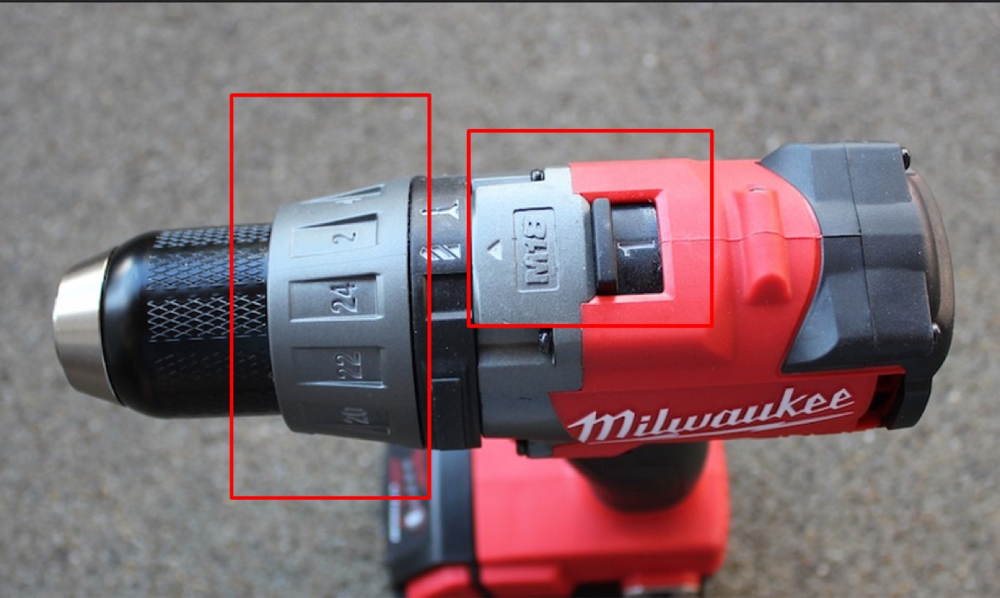

# Rooftop, Ladder & Drill Safety

## Rooftops

Our install and maintenance work often involves going onto rooftops of buildings. Regardless of the roof access, size, material, roof “edges,” or other factors, PCW uses the following rules and guidelines to ensure safety while on rooftops.

Stay away from the edge of the roof as much as possible. Do not lean over the roof to look down or inspect the area for tasks like cable clipping unless absolutely necessary. If you are nearing a roof edge for work purposes, lower your center of gravity the closer you get. Work on your knees, while sitting, or if right by the edge, lay flat on your stomach.

Never move quickly on a roof. Do not run.

When pulling items up to the roof via rope, keep weight below ~25lbs per bag. People on the roof pulling up a bag must be sitting or lying down when doing so.

Avoid dropping items off the roof. If mounting equipment to the side of a building, work in pairs, with one spotter holding the physical equipment while the other uses a fastening tool.

Learn more about best practices for roof safety in [this article](https://www.buildings.com/industry-news/article/10187943/best-practices-for-roof-safety) and [OSHA document](https://www.osha.gov/sites/default/files/publications/OSHA3755.pdf).

## Ladders

PCW uses ladders at most of our installs and maintenance visits. We have three kinds of ladders: step, telescoping, and folding extension.

Telescoping and unfolded extension ladders should be positioned at a 4-to-1 ratio, meaning the feet of the ladder should be 25% of total ladder height from the wall.

<!-- image held: third-party ladder infographic (4 to 1 rule); images to be sorted out later -->

Ladder climbers should wear shoes with grip on the bottom. Only one person on a ladder at one time. A person must be off and away from the ladder, unless they are holding it in place for safety, before the next person uses it.

The safest way to climb a ladder is using three points-of-contact at all times. Do not make sudden or quick movements. Movements should be made one foot or one hand at a time. The climber’s body should always face square with the ladder. Do not turn away from the ladder while on it.

<!-- image held: third-party ladder infographic (three points of contact); images to be sorted out later -->

Ladders should not be in front of doors that can open towards the ladder. If this is necessary at any point, the door must be propped open or guarded by a member of PCW.

Learn more about best practices for [ladder safety here](https://www.americanladderinstitute.org/page/BasicLadderSafety).

## Drills

Drills are the only power tool that PCW uses on installs. Power tools can inherently be more risky than other types of tools, and should be taken seriously at all times.

Maintain situational awareness. Distractions while drilling or being around a powered drill are one of the easiest ways to lead to injury.

After adding a drillbit, test the drillbit’s position before using it to create a penetration. Move the drill into “forward” and point it down towards the ground, away from others, to see that the bit is turning properly, and it’s not wobbly or “spiraling.” Drills should always be kept in “neutral” when not in use.

Always check and double check what’s on the other side of where you’re drilling. Make sure to use the appropriate drill bit for the material. See more information in the [Recommendations for Drilling into Buildings](#recommendations-for-drilling-into-buildings) section.

Keep drills to low speed and power when possible. Start low and speed up until at necessary speeds and torque. Remove sawdust/debris from the penetration regularly. During or after usage, give the drill time to cool down before touching a drill bit.

When using the drill on a ladder, climb the ladder first and then have the drill handed to you by someone on the ground (when possible from them to reach you/when your position on the ladder is reachable by someone on the ground).

To learn more about how to safely use a drill, [watch this YouTube video](https://www.youtube.com/watch?v=GGZ9zJkFOCg).

### Recommendations for Drilling into Buildings

Drilling penetrations into buildings, either for running cables from indoors to outside or mounting enclosures and J-arms, are most likely where we have the largest chance of potentially damaging a building. Only drill when needed, always look for pre-existing penetrations and cable runs.

#### Start with a minimum amount of force

Start slow and gradually increase speed/torque if you aren’t making progress. You can add more force either through the drill or by using extra pressure from behind the drill with your hand/core/body.

How do you adjust speed and torque on the drill? You’ll see numbers and switches like so on our Milwaukee cordless drills:

These two controls control speed and torque:

- Speed (rear switch) - how fast the drill turns. 1 is low speed/high torque; 2 is high speed/low torque.
- Torque (dial, technically called the “clutch”) - how much force is applied. Also controls the limit of torque before the drill stops.

#### Consider the material you are drilling through

For small holes and soft wood, drill fast instead of slow to prevent chewing through them. For hard and other soft materials like plastic/ceramic/tiles, drill slowly to prevent friction, heat, and/or vibration that destroy the material. Going slow usually makes it easier to make the penetration look pretty/even on the edges.

#### Only drill as long as your screw or bolt

Making the penetration longer than the actual length of the screw/bolt leaves empty space for water and moisture. You can fill a hole with sealant and then insert/drill the screw, which will fill the gaps in the screw with sealant. Seal under the head of the screw to prevent moisture ingress from the top of the penetration as well.

#### Choose the right drill bit

Wood bits have a sharp, point center tip (brad point) for precise positioning, along with outer spurs designed to sever wood fibers for clean, splinter-free holes. Sometimes also called a “spade bit” since it resembles a spade.

Masonry bits have a wide, durable tungsten carbide tip that often resembles an arrowhead. When drilling into concrete, you’ll most likely need to pre-drill a hole. Use the proper masonry bit (usually the Tapcon drill bit corresponding to the masonry screw you’re using). Use the hammer drill setting when pre-drilling. Consider the size/width of the drill bit – make sure it matches or is slightly under the width of the screw.

#### When drilling inside

Drill near window and door frames to stay away from HVAC, electrical wires, and any sort of plumbing. It also allows for the shortest distance when drilling through to the other side.

If it is not ideal or feasible to drill near window and door frames, here are some considerations:

- Look for other penetrations or cable runs to follow a similar pathway.
- Check what’s on both sides of the area to ensure clearance, and to look for potential opportunities to cause damage.
- Be considerate of placement for ease of use for PCW, to avoid putting us in risky positions.
- Don’t drill immediately next to an existing power outlet or electrical cable.
- Drilling through the floor should only be considered if we know what’s inside the floor, or we can clearly see where cables and other items have been run. Measure distances where and when possible to ensure floor drilling is matching expectations between floors.
