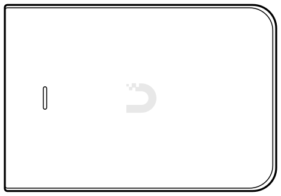
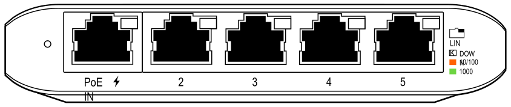
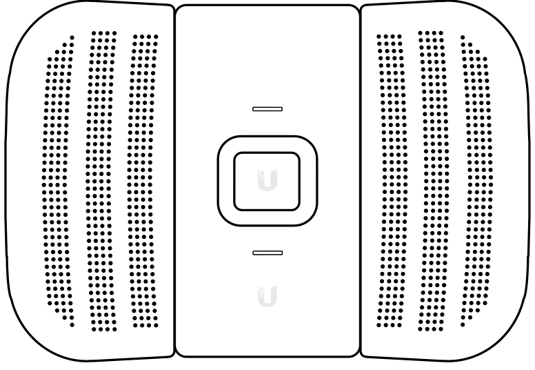

# Hardware

The following materials are used for [Installations](installations.md). Further information about configuring many of these devices can be found in the Installation guides in these docs.

See NYCMesh's [Networking Hardware](https://docs.nycmesh.net/hardware/) and [Installation Equipment](https://docs.nycmesh.net/installs/equipment/) docs for further details and information on the hardware and tools below.

## Networking Hardware
### Access Points

#### Indoor/Outdoor Installs

  <figure>
    
    <figcaption><a href="https://store.ui.com/products/unifi-ac-mesh-ap">UAP-AC-M</a> 'Bunny Ears'</figcaption>
  </figure>
  <figure>
    
    <figcaption><a href="https://store.ui.com/collections/operator-airmax-and-ltu-antennas/products/directional-dual-band-antenna-for-uap-ac-m">UMA-D</a> Directional antenna</figcaption>
  </figure>

The UMA-D clips onto a UAP-AC-M in place of its antennas, to aim coverage in one direction instead of
spreading it evenly.

- [Ubiquiti UAP-Flex-HD](https://store.ui.com/us/en/products/uap-flexhd)
- [Ubiquiti U6 Mesh](https://store.ui.com/us/en/products/u6-mesh)
- [Ubiquiti U6 Mesh Pro](https://store.ui.com/us/en/products/u6-mesh-pro)
- [Ubiquiti U6 LR](https://store.ui.com/us/en/products/u6-lr)
- [Ubiquiti UAP-AC-M-Pro](https://store.ui.com/us/en/products/uap-ac-mesh-pro)
- [Ubiquiti U7 Outdoor](https://store.ui.com/us/en/products/u7-outdoor)
- [Ubiquiti Swiss Army Knife](https://store.ui.com/us/en/products/uk-ultra)

#### Indoor Installs

Indoor access points come in three shapes. Which one you want is mostly a question of where it can be
mounted at the site.

  <figure>
    
    <figcaption><strong>Round, ceiling or wall</strong> nanoHD, U6 Lite, U6+, U6 Pro, U7 Lite, U7 Pro</figcaption>
  </figure>
  <figure>
    
    <figcaption><strong>In-wall faceplate</strong> UAP-AC-IW, U7 In-Wall</figcaption>
  </figure>
  <figure>
    
    <figcaption><strong>Outlet plug-in</strong> <a href="https://store.ui.com/us/en/products/uap-beaconhd">UAP-BeaconHD</a></figcaption>
  </figure>

- [Ubiquiti UAP-nanoHD](https://store.ui.com/us/en/products/uap-nanohd)
- [Ubiquiti UAP-AC-Inwall](https://store.ui.com/us/en/products/uap-ac-iw)
- [Ubiquiti U6 Extender](https://store.ui.com/us/en/products/u6-extender)
- [Ubiquiti U6+](https://store.ui.com/us/en/products/u6-plus)
- [Ubiquiti U6 Lite](https://store.ui.com/us/en/products/u6-lite)
- [Ubiquiti U6 Pro](https://store.ui.com/us/en/category/wifi-flagship/products/u6-pro)
- [Ubiquiti U7 Lite](https://store.ui.com/us/en/products/u7-lite)
- [Ubiquiti U7 Pro](https://store.ui.com/us/en/products/u7-pro)
- [Ubiquiti U7 Pro Max](https://store.ui.com/us/en/products/u7-pro-max)
- [Ubiquiti U7 In-Wall](https://store.ui.com/us/en/products/u7-iw)
- [Ubiquiti U7 Long Range](https://store.ui.com/us/en/products/u7-lr)
- [Ubiquiti UAP-BeaconHD](https://store.ui.com/us/en/products/uap-beaconhd)

### Switches
- [Ubiquiti USW Flex Mini](https://store.ui.com/us/en/products/usw-flex-mini)
- [Ubiquiti USW Flex](https://store.ui.com/us/en/category/switching-utility/products/usw-flex)

<figure class="device-diagram">
    
    <figcaption>USW Flex Mini ports. Port 1 accepts PoE in and powers the switch, so it is the one that goes back toward the router.</figcaption>
</figure>

### Routers
- [Ubiquiti EdgeRouter X](https://store.ui.com/collections/operator-edgemax-routers/products/edgerouter-x)
- [Ubiquiti EdgePoint R6](https://store.ui.com/collections/operator-edgemax-control-points/products/edgepoint-r6) - see [NYC Mesh's doc](https://docs.nycmesh.net/hardware/epr6/) on this alternative to ER-X's.

<figure class="device-diagram">
    
    <figcaption>ERX ports. See <a href="../../device-configuration/configure-edgerouter-x/">Configure EdgeRouter X</a> for what goes where.</figcaption>
</figure>

### PtP and PtMP radios

  <figure>
    
    <figcaption><a href="https://store.ui.com/collections/wireless/products/litebeam-5ac-gen2">LiteBeam AC Gen2</a></figcaption>
  </figure>
  <figure>
    
    <figcaption><a href="https://techspecs.ui.com/uisp/wireless/pbe-5ac-500">PowerBeam 5ac 500</a></figcaption>
  </figure>

- [airMAX LiteBeam AC 5 GHz Bridge](https://store.ui.com/collections/wireless/products/litebeam-5ac-gen2)
- [airMAX PowerBeam 5ac 500](https://techspecs.ui.com/uisp/wireless/pbe-5ac-500)
- [airMax NanoBeam M5](https://store.ui.com/us/en/products/nbe-m5-16)
- [airMax NanoStation M5 loco](https://store.ui.com/us/en/category/wireless-airmax-5ghz/products/locom5)

### Mounts

- [Universal J-Arm Mount](https://store.ui.com/collections/operator-airmax-and-ltu-accessories/products/universal-antenna-mount)
- [Window Mount](https://store.ui.com/collections/operator-airmax-and-ltu-accessories/products/nanostation-window-mount)
- [Non-penetrating Roof Mount](https://www.data-alliance.net/non-penetrating-roof-mount-base-fits-pipe-mast-antenna-mounts-extendable-up-to-7ft-mast/)
- Enclosure(s)

### Accessories

<figure class="device-diagram">
    
    <figcaption>A PoE injector powers an AP over its Ethernet cable, so the AP needs no outlet of its own.</figcaption>
</figure>

- Short-to-medium length Ethernet cable(s)
- Outdoor-rated power strip(s)
- Outdoor-rated extension cord(s)    
- outdoor-rated power splitter(s)
- [Extension cords](https://www.newegg.com/black-monoprice-6-00-ft-others/p/0N6-01B8-002D6)
- [PoE Injector/Splitter](https://www.newegg.com/p/2WG-00DK-00004)
- [Ethernet to Ethernet adapter/coupler](https://www.newegg.com/p/0Y3-02J6-00001)
- Pass-through Ethernet (RJ45) heads
- [USB Type C to Ethernet adapter](https://www.ebay.com/itm/132225990432?epid=910384900&hash=item1ec9487f20:g:FhgAAOSwqiVdyN)

## Tools

### Networking

- [Ethernet cable crimper](https://www.homedepot.com/p/Klein-Tools-Compact-Ratcheting-Modular-Crimper-VDV226-107/204732347?source=shoppingads&locale=en-US&srsltid=AfmBOopOP-5p-ibEZ6Xg-9GSiYkxoTyprixZLrUXPKiSeqJMjNqTxc5oPwU)
- CAT5e cable stripper
- [Ethernet cable tester](https://www.lowes.com/pd/Klein-Tools-Cable-Tester-Kit-with-Scout-Pro-3-Tester-Remotes-Adapter-Battery/5014306081)
- Mobile hotspot 
- Unifi WifiMan spectrum analyzer 

### Hardware tools

- Drill(s) - drill driver, hammer
- Impact driver
- Drill bit set 
- Cobalt / titanium drill bit (1/4")
- Carbide-tip masonry drill bit (5/32")
- Hex socket drill bits (3/8" for hose clamps and 1/4" for masonry screws)
- Mortar and Wood drill bits
- Hammer
- Scissors
- Snips
- Needlenose pliers
- Screwdrivers - Phillips, Flathead, Torx
- Socket wrenches
- Tape measure
- Laser ruler
- Fishtape/push rod
- Files - triangular, flat, round 
- Adjustable crescent wrench (6")
- Extra bag for carrying/lifting equipment 
- Rope
- Utility knife
- Allen wrenches 
- Wire stripper 

### Consumables
- Concrete nails
- Concrete screws (3/16" hex head CSH316134)
- Screws
- Nails
- Cable fastener clips
- Hose clamps
- Zipties
- Electrical tape
- Velcro strips 
- Velcro cable ties 
- PCW stickers 
- Rubberized waterproof sealant
- Superglue

### PPE
- Safety glasses
- Work gloves 
- KN95 masks
- First aid Kit
