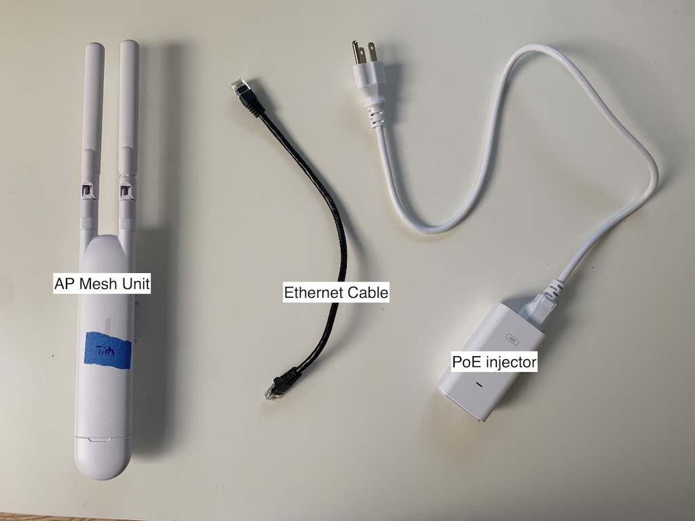
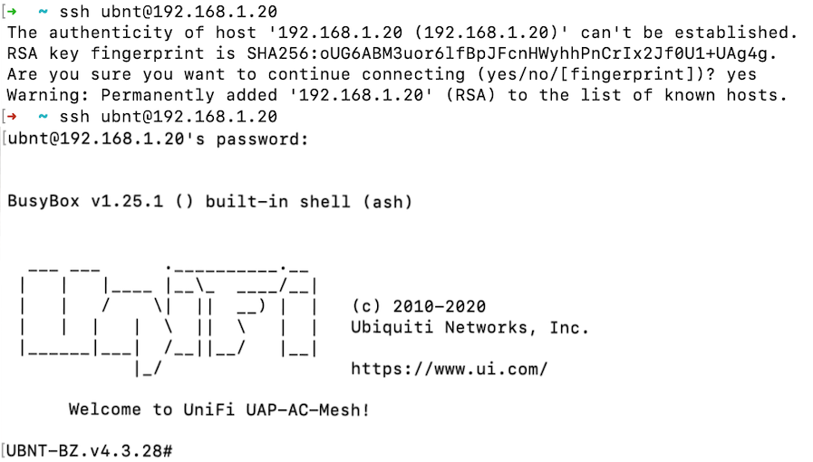

<!-- TODO: machine-drafted Spanish translation — needs review by a fluent speaker. -->
!!! note "Traducción preliminar"
    Esta página es una traducción preliminar y está pendiente de revisión. Si encuentra un error, la [versión en inglés](../../../device-configuration/configure-ap-mesh/) es la referencia.

<figure class="device-diagram">
    
    <figcaption>El UAP-AC-M, también conocido como 'orejas de conejo'</figcaption>
</figure>

Esta guía le explica paso a paso cómo configurar un Ubiquiti Access Point AC Mesh ("orejas de conejo"). El proceso consiste en los siguientes pasos:

- Encender el Unifi AP AC Mesh y restablecerlo a la configuración de fábrica
- Conectar el dispositivo a su computadora y asegurarse de que tenga una ruta a Internet
- Identificar la dirección IP del AP y usar `ssh` para conectarse al dispositivo: `ssh ubnt@192.168.1.20`
- Indicarle al dispositivo la URL de nuestro controlador Unifi: `sudo set-inform http://unifi.phillycommunitywireless.org:8080/inform`
- Adoptar el dispositivo desde la interfaz del controlador
- Configurar el dispositivo y actualizar su firmware

## Lo que necesitará

| Artículo                                     | Para qué sirve                                    |
| -------------------------------------------- | ------------------------------------------------- |
| Punto de acceso Unifi                        | La unidad que se va a configurar                  |
| Inyector PoE (alimentación a través de Ethernet), incluido con el AP | Suministra electricidad al AP |
| 2 cables Ethernet                            | Uno alimenta el AP y el otro proporciona el enlace de datos a la computadora |
| Adaptador USB a Ethernet                     | Si su computadora no tiene puerto Ethernet        |
| Computadora con MacOS o Linux                | Para realizar la configuración remota             |
| Tomacorriente de pared                       |                                                   |
| Clip (u otro objeto delgado)                 | Para restablecer la configuración de fábrica      |

## Pasos de configuración

### 1. Encienda el dispositivo y restablezca la configuración de fábrica

1. Conecte el inyector PoE a un tomacorriente o a una regleta de enchufes.
2. Conecte el puerto `POE` del inyector al AP de malla con un cable Ethernet. Debería ver que se enciende una luz blanca.

<figure class="device-diagram">
    
    <figcaption>El inyector va entre el tomacorriente de pared y el AP. Un cable lleva electricidad y datos al AP; el otro es el enlace de datos de regreso a su computadora o router.</figcaption>
</figure>

!!! info ""

    La luz será azul si el dispositivo tiene una configuración anterior. No se preocupe: a continuación vamos a restablecer el dispositivo a la configuración de fábrica.

Los AP de malla han tenido un comportamiento inesperado incluso recién sacados del empaque, por lo que se recomienda restablecerlos a la configuración de fábrica antes de continuar.

1. Con el clip, presione el botón de reinicio (reset) que está en la parte inferior del AP de malla hasta que haga clic.
2. Manténgalo presionado durante 5 segundos.
3. La luz de estado del AP debería parpadear y luego apagarse mientras el dispositivo se reinicia. Cuando vuelva a encenderse, debería quedar en blanco fijo, lo que indica que el restablecimiento se completó correctamente. 
4. Para obtener más información sobre las luces de estado, consulte [Patrones de color de los LED de los dispositivos UniFi](troubleshoot-devices.md#indicadores-led-de-estado-de-los-ap-unifi)

Nota: El AP de malla puede tardar unos minutos en iniciarse después de conectarlo o restablecerlo, así que espere hasta que la luz de estado esté en blanco fijo.

### 2. Conecte el AP a su computadora

Necesitamos conectar el dispositivo a nuestra computadora y averiguar su dirección IP, y al mismo tiempo asegurarnos de que también tenga una ruta a Internet. 

!!! info ""
    Normalmente, cualquier dispositivo en su red recibe una dirección IP mediante el protocolo de configuración dinámica de host (Dynamic Host Configuration Protocol, o DHCP). Esto permite que su router sepa con qué dispositivo se está comunicando en su red. Aunque los AP Unifi se restablecen a `192.168.1.20`, si el AP ya se ha configurado antes, es posible que reciba otra dirección IP. 

Los AP de malla Unifi deberían restablecerse automáticamente a `192.168.1.20`, así que primero puede pasar directamente al [paso 3](#3-conectese-al-ap-por-ssh) y ver si funciona el comando `ssh`. 

Si la dirección IP del AP de malla no es `192.168.1.20`, hay dos formas de encontrarla: 

<ol type="a">
  <li>Conectarlo al router local </li>
  <li>Conectarlo a su computadora</li>
</ol>

Por lo general, usamos la opción b): conectar el AP directamente a nuestra computadora.

#### 2a) Si tiene acceso físico a su router wifi

1. Conecte el puerto `LAN` del inyector PoE directamente a un puerto Ethernet de su router. 
2. El AP obtendrá la dirección IP `192.168.1.20` de su router. [Pase directamente al paso de SSH](#3-conectese-al-ap-por-ssh).

#### 2b) Si no tiene acceso a su router

1. Conecte el puerto `LAN` del inyector a su computadora, usando el adaptador USB a Ethernet si no tiene un puerto Ethernet.
2. Asegúrese de que su computadora esté conectada al wifi.
3. La dirección IP de su computadora debe ser estática para que usted pueda ver el AP y conectarse a él por `ssh`.
4. Siga las instrucciones de [Configurar una IP estática en su computadora](configure-computer.md#configurar-una-direccion-ip-estatica) para establecer su dirección IP.
5. También puede seguir las instrucciones de [Compartir una conexión wifi por Ethernet](configure-computer.md#compartir-una-conexion-wifi-por-ethernet) para compartir la conexión inalámbrica de su computadora con el AP.
6. Para encontrar la dirección IP del AP, o si la conexión SSH se queda colgada, pruebe ejecutar `arp -a` para encontrar el AP.

### 3. Conéctese al AP por SSH

!!! info ""
    `ssh`, o Secure Shell, es un protocolo que se usa para proteger las comunicaciones en una red mediante criptografía de clave pública. Usamos `ssh` para conectarnos a los AP desde la línea de comandos para configurarlos y adoptarlos.  

1. En la terminal, ejecute el comando `ssh ubnt@192.168.1.20`, o reemplace la dirección IP predeterminada por la que copió.
2. Es posible que vea "`The authenticity of host [...] can't be established`" (no se puede comprobar la autenticidad del host). Escriba "yes" y presione Enter.
3. Cuando se le pida la contraseña, escriba `ubnt`.
4. Ahora debería estar conectado al AP de malla.

   

!!! warning ""

    Si recibe el error `Host key verification failed`, tendrá que editar su archivo `known_hosts`.
    1. La forma más fácil es ejecutar el siguiente comando (al menos en Ubuntu funciona): `sudo ssh-keygen -f "/root/.ssh/known_hosts" -R "192.168.1.20"`
    1. Otra opción es abrir `~/.ssh/known_hosts` con `vim`, `nano` o el editor de texto que prefiera.
    2. Elimine la línea que comienza con `192.168.1.20` (se verá parecida a `192.168.1.20 ssh-rsa AAAAB3NzaC1yc2E...`) y guarde el archivo.

### 4. Adopte el AP de malla

!!! info "" 

    Necesitará acceso a la interfaz del controlador Unifi de PCW para completar este paso.

1. Desde su sesión de `ssh`, ejecute el comando `sudo set-inform http://unifi.phillycommunitywireless.org:8080/inform`. Esto enviará un mensaje por Internet a nuestro controlador para avisarle que el dispositivo quiere ser adoptado.

    !!! warning ""

        Si el comando se queda colgado aquí, lo más probable es que su AP no tenga una ruta a Internet. [Regrese al paso de conexión](#2-conecte-el-ap-a-su-computadora) y asegúrese de que su configuración siga esas instrucciones.

2. Abra en su navegador el portal Hostifi del controlador Unifi y vaya a la lista de dispositivos. El AP debería aparecer en la lista de dispositivos en espera de adopción.
3. Presione `Adopt` (adoptar) para adoptar el AP de malla.
4. La adopción puede tardar un rato. Pruebe actualizar el portal Hostifi, el navegador o ambos. 
5. Se le pedirá que elija un grupo (Group) para el AP. Elija All APs (todos los APs) y presione Save (guardar).
6. Regrese al Dashboard (panel principal) para ver si el dispositivo ya se adoptó.
7. Si el dispositivo se queda colgado durante la adopción, pruebe la opción Forget (olvidar) y vuelva a ejecutar el comando `set inform`.

### 5. Configure el AP y establezca la versión del firmware 

1. Cambie la configuración para agregar su nombre y un número a cada dispositivo que configure. El equipo de administración volverá a etiquetar los dispositivos al instalarlos.
2. Para actualizar el firmware desde el controlador, vaya al dispositivo y abra Settings (configuración). En Manage (administrar), busque el campo Location URL (URL de ubicación), pegue el enlace de la versión del firmware y presione Update (actualizar).
    * Las URL del firmware están disponibles en el sitio de [Unifi](https://ui.com/download/unifi) (en inglés)

Puede ajustar otras opciones del dispositivo en la configuración, pero es mejor dejar la configuración de radio con los valores predeterminados hasta que el dispositivo esté instalado en la red.

También puede establecer la versión del firmware mientras está conectado al dispositivo por `ssh`:

1. Mientras está conectado al dispositivo por `ssh`, escriba `upgrade $url_to_firmware_version`
2. Se desconectará del dispositivo. Espere a que se reinicie y la luz esté en blanco fijo (puede hacer `ping` a la dirección IP para comprobar si ya está en línea, o simplemente intentar conectarse por SSH) y luego vuelva a conectarse por `ssh`.
3. Si se queda colgado, pruebe cancelar y volver a ejecutar el comando.
4. Puede comprobar que el firmware se actualizó mirando el encabezado de la línea de comandos, que muestra la versión del firmware, por ejemplo "UBNT-BZ.v4.3.20#".

!!! warning ""

    La actualización del firmware suele quedarse colgada. Recomendamos actualizar el firmware desde el controlador Unifi.
