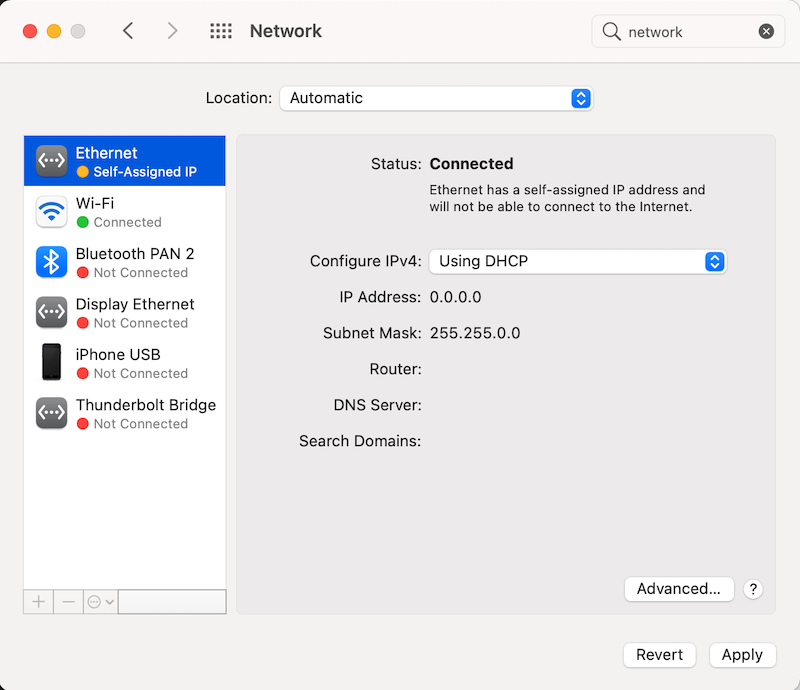
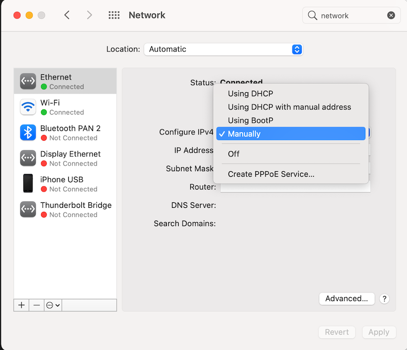
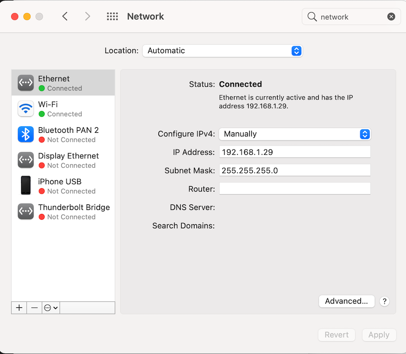
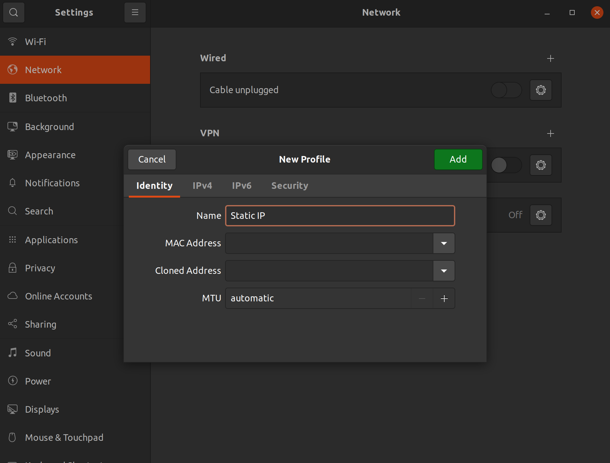
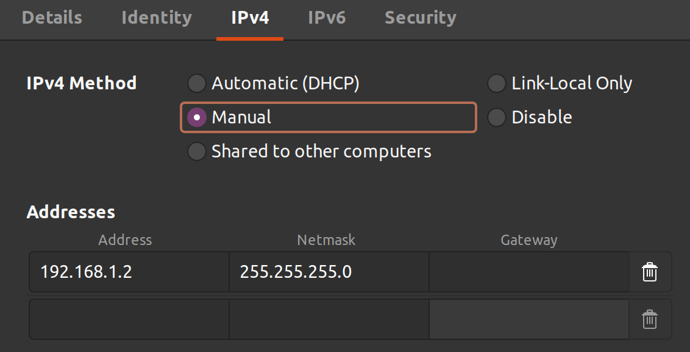
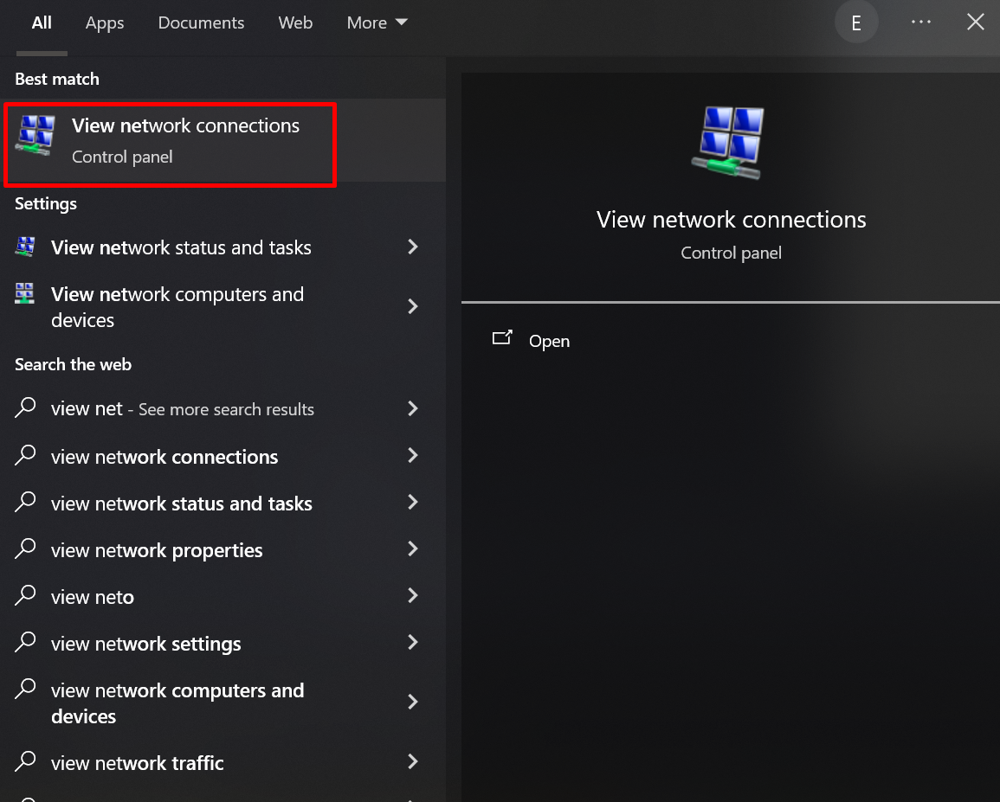
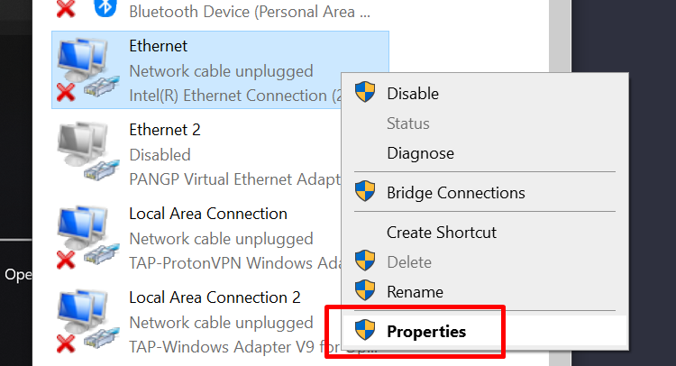
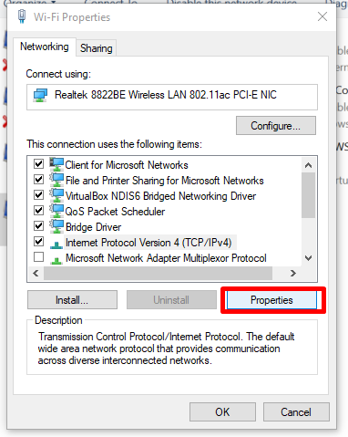
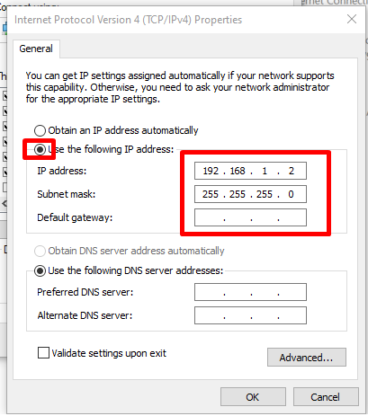

<!-- TODO: machine-drafted Spanish translation — needs review by a fluent speaker. -->
!!! note "Traducción preliminar"
    Esta página es una traducción preliminar y está pendiente de revisión. Si encuentra un error, la [versión en inglés](../../../device-configuration/configure-computer/) es la referencia.

Esta página explica cómo configurar su computadora para poder conectarse a los dispositivos de red. Veremos cómo establecer una dirección IP estática y cómo compartir la conexión a Internet con otras computadoras.

# Configurar una dirección IP estática
Esta sección contiene instrucciones para configurar el adaptador Ethernet de su computadora para que use una dirección IP estática en la subred 192.168.1.\*. Este paso es necesario para conectarse a ciertos dispositivos de red por Ethernet, y se usa en nuestras instrucciones de configuración del [EdgeRouter X](configure-edgerouter-x.md) y del [AP de malla](configure-ap-mesh.md).

Elija el sistema operativo de su computadora:

* **[MacOS](#macos)**
* **[Ubuntu](#ubuntu)**
* **[Windows](#windows)**

## MacOS

1. Abra `System Preferences` (Preferencias del Sistema) > `Network` (Red).
2. Seleccione la conexión Ethernet que tiene con el dispositivo que desea configurar.
   
3. Cambie el valor de `Configure IPv4` (configurar IPv4) a `Manually` (manualmente).
   
4. Establezca la dirección IP (IP Address) en `192.168.1.2`.
5. Establezca la máscara de subred (Subnet Mask) en `255.255.255.0`
   
6. Haga clic en `Apply` (aplicar)

## Ubuntu

_Estas instrucciones solo se han probado en Ubuntu 20.04._

1. Abra `Settings` (Configuración) > `Network` (Red).
2. En la sección "wired" (cableada), haga clic en el signo de más para crear un nuevo perfil de configuración. Nombre el perfil "Static IP" o como usted prefiera.
   
3. En la pestaña **IPv4**, elija "Manual".
4. Establezca el campo Address (dirección) en `192.168.1.2`  
5. Establezca la Netmask (máscara de red) en: `255.255.255.0`  
   (Deje Gateway (puerta de enlace) vacío, y DNS/Routes (rutas) en Automatic (automático))
   
6. Haga clic en "add" (agregar); debería ver aparecer el perfil en su configuración. Selecciónelo cuando esté conectado para activar la configuración de IP estática.

## Windows 

1. Abra `Network Connections` (Conexiones de red) (escriba 'view network connections' en la búsqueda de Windows)
2. Haga clic derecho en el adaptador de red deseado para abrir el menú contextual y luego haga clic en 'Properties' (Propiedades)
3. En el menú '(Adapter Name) Properties', haga doble clic en 'Internet Protocol Version 4 (TCP/IPv4)', o selecciónelo y luego haga clic en 'Properties'. 
4. En el menú 'Internet Protocol Version 4 (TCP/IPv4) Properties', seleccione 'Use the following IP address' (Usar la siguiente dirección IP):
5. Establezca la dirección IP (IP Address) en `192.168.1.2`
6. Establezca la máscara de subred (Subnet mask) en `255.255.255.0`

7. Haga clic en `OK` 

## Detalles
Estos pasos usan `192.168.1.2` como IP estática, pero puede ser cualquier dirección dentro del rango `192.168.1.0/24` (`.0-.255`) excepto `.0` (la red), `.1` (la puerta de enlace), `.20` (la IP predeterminada del AP de malla) y `.255` (difusión o *broadcast*).

# Compartir una conexión WiFi por Ethernet
Esta sección describe cómo conectar un dispositivo a su computadora por Ethernet y compartir con ese dispositivo la conexión a Internet que ya tiene su computadora. En otras palabras, su computadora funcionará como puerta de enlace (*gateway*) y el dispositivo conectado podrá enviar paquetes a Internet a través de su computadora.

Esto es útil cuando necesita que un dispositivo tenga acceso a Internet mientras está conectado en red con su computadora, pero usted no tiene acceso a su router. Lo usamos como una opción en nuestras instrucciones de configuración del [AP de malla Unifi](configure-ap-mesh.md).

Elija el sistema operativo de su computadora:

**[Ubuntu](#ubuntu_1)**  
**[MacOS](#macos_1)**  
**[Windows](#windows_1)**  

## Ubuntu
1.  Abra `Settings` (Configuración) > `Network` (Red).

2.  En la sección `Wired` (cableada), haga clic en el signo de más para crear un nuevo perfil de configuración. Nombre el perfil "Shared" o como usted prefiera.

3.  En la pestaña **IPv4**, elija "Shared to other computers" (compartida con otras computadoras). Haga clic en Apply (aplicar). Su computadora ahora debería estar conectada en red con el AP. 10.42.0.0/24 es la subred predeterminada que usa Ubuntu para esta configuración, pero no hay garantía de que su computadora use esa subred. Si el siguiente paso no devuelve resultados, ejecute `ip address` o `ifconfig` y busque allí la IP de su interfaz Ethernet (normalmente `eth0`).

4.  Abra una terminal. Escriba lo siguiente para escanear los dispositivos en ese rango de IP:

        nmap -sn 10.42.0.0/24 | grep report

    Debería ver dos líneas que empiezan con "`nmap scan report`". Busque la línea con una dirección IP que no termine en "`.1`" y copie esa dirección IP.

Si el comando nmap se queda colgado, también puede probar las instrucciones de Mac OS en Ubuntu Linux y deberían funcionar bien.

## MacOS
_Comience estos pasos con el AP desconectado de su computadora (sin conectarlo a un puerto o adaptador Ethernet)._

1.  Abra `Sharing` (Compartir) desde el menú `System Preferences` -> seleccione `Internet Sharing` (Compartir Internet) en la lista de la izquierda -> seleccione las interfaces para las que desea activar el uso compartido -> marque la casilla junto a `Internet Sharing` para activarlo -> aparecerá un cuadro de advertencia; haga clic en `Start` (iniciar).

2.  Ejecute `arp -a | grep -v incomplete` para mostrar la correspondencia entre direcciones IP y direcciones MAC de los dispositivos de su red.

3.  Conecte el AP a su computadora o adaptador y ejecute `arp -a | grep -v incomplete` de nuevo. La diferencia entre este resultado y el del grep anterior debería ser el AP. Anote la dirección IP y la dirección MAC.

4.  Para confirmar que el AP tiene una ruta hacia Internet, conéctese a él por SSH usando la dirección IP que anotó (consulte [Conéctese al AP por SSH](configure-ap-mesh.md#3-conectese-al-ap-por-ssh)) y, desde allí, haga `ping` a una dirección externa.

Nota: Estas instrucciones se elaboraron en una MacBook con Catalina, versión 10.15.7.

## Windows 
*Comience estos pasos conectando el AP a un inyector PoE, y conectando el puerto LAN del inyector PoE al puerto Ethernet de su computadora.*

1. Abra el menú 'Settings' (Configuración) y luego haga clic en 'Network and Internet' (Red e Internet)  

2. En 'Advanced Network Settings' (Configuración de red avanzada), haga clic en 'Change Adapter Options' (Cambiar opciones del adaptador)

3. En la ventana emergente, haga clic derecho en la interfaz por la que está conectado a Internet (probablemente será 'Wifi' o 'Ethernet') y luego haga clic en 'Properties'

4. En la segunda ventana emergente, haga clic en la pestaña 'Sharing' (Uso compartido).

5. En 'Internet Connection Sharing' (Conexión compartida a Internet), seleccione 'Allow other network users to connect through this computer's Internet connection' (Permitir que los usuarios de otras redes se conecten a través de la conexión a Internet de esta computadora). 

6. En el menú desplegable, seleccione la interfaz a la que está conectado el AP/inyector PoE. 

7. Haga clic en 'OK' 

8. Ejecute `arp -a` y busque la dirección MAC del AP en la tabla ARP. 

Nota: estas instrucciones se elaboraron en Windows 10.
