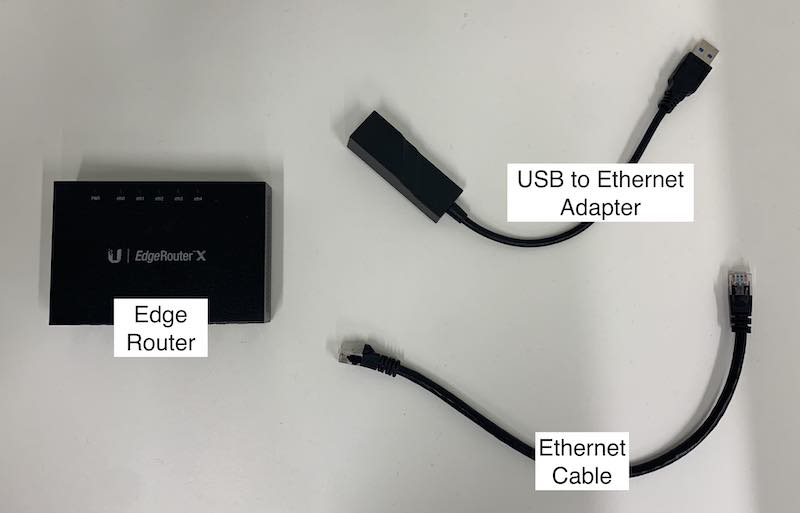
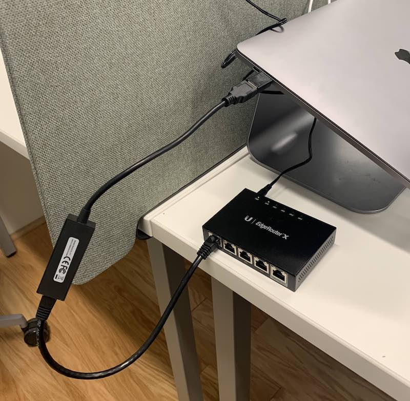
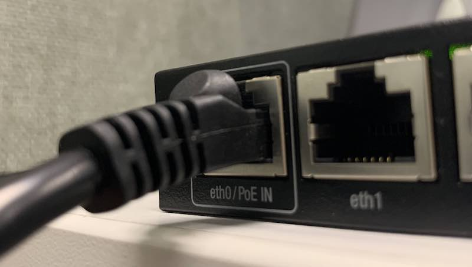
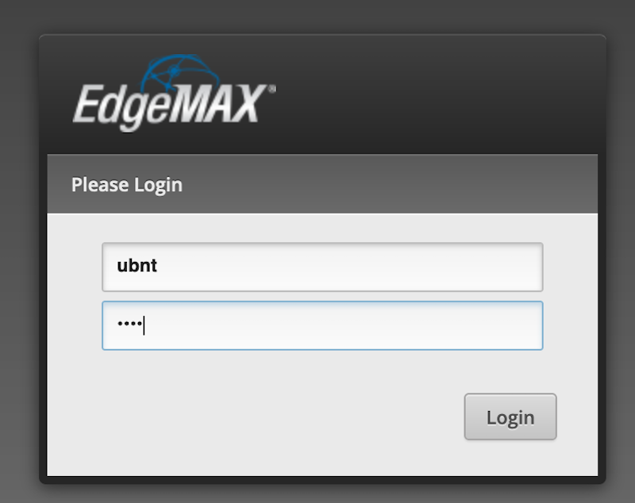
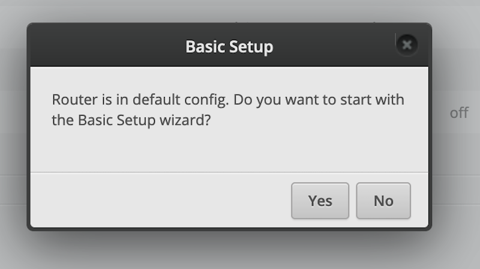
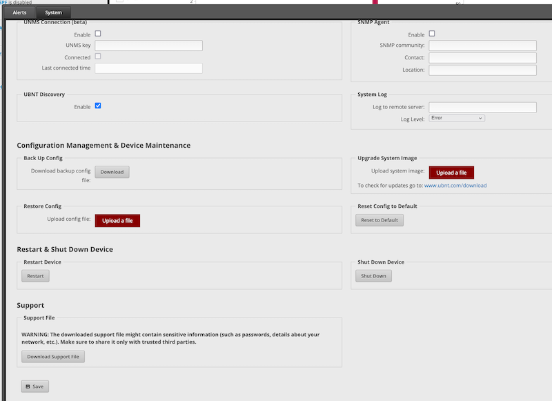

# Configurar ERX Router

Esta guía le guiará a través de la configuración de un Ubiquiti EdgeRouter X.

## Hardware requerido

* Router e cable de alimentación
* Tranque cable
* Computador
* Adaptador Ethernet USB (si la computadora no tiene puerto Ethernet)

## Pasos de instalación

### Establecer IP estática en el equipo

Ver [Configurar una IP estática](configure-computer.md)

### Conecte el ERX

El ERX tiene cinco puertos Ethernet. `eth0` recibe alimentación por PoE y es el puerto por el que se
configura el router; `eth4` es el puerto WAN y el que devuelve PoE hacia una LiteBeam.

<figure class="device-diagram">
    
    <figcaption>Puertos del ERX, de izquierda a derecha</figcaption>
</figure>

1. Conecte el ERX a su cable de alimentación y conecte el cable de alimentación a una toma de corriente.
2. Conecte el puerto `eth0` del ERX al ordenador con un cable Ethernet, utilizando el adaptador Ethernet USB si no dispone de un puerto Ethernet.

### Configurar ERX

1. Descargue el [ERX config file](../../assets/configs/erx-config.tar.gz)
2. Navegue al portal en [https://192.168.1.1](https://192.168.1.1) en su navegador.
3. Regístrese sesión en el portal con nombre de usuario `ubnt`, contraseña `ubnt`.
   
4. En el `Use wizard?` , presione no.
   
5. Presione la pestaña `System` en la parte inferior de la página.
6. En la sección `Restore Config` , presione `Upload a file` y seleccione el archivo de configuración de ERX que descargó.
   
7. El ERX se reiniciará utilizando la nueva configuración.
8. ¡Eso es todo! Si necesita realizar más configuración, puede volver a iniciar sesión en el portal utilizando el nombre de usuario `pcwadmin`, y una contraseña que puede obtener de los mantenedores del proyecto.
