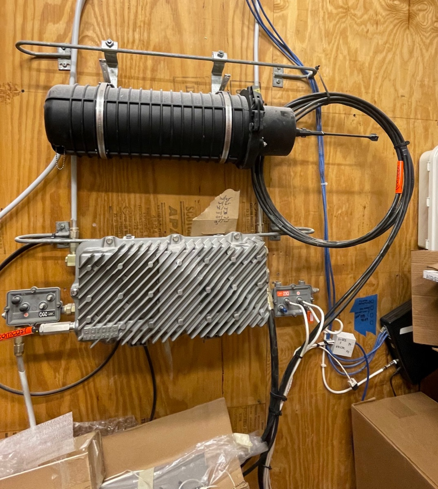
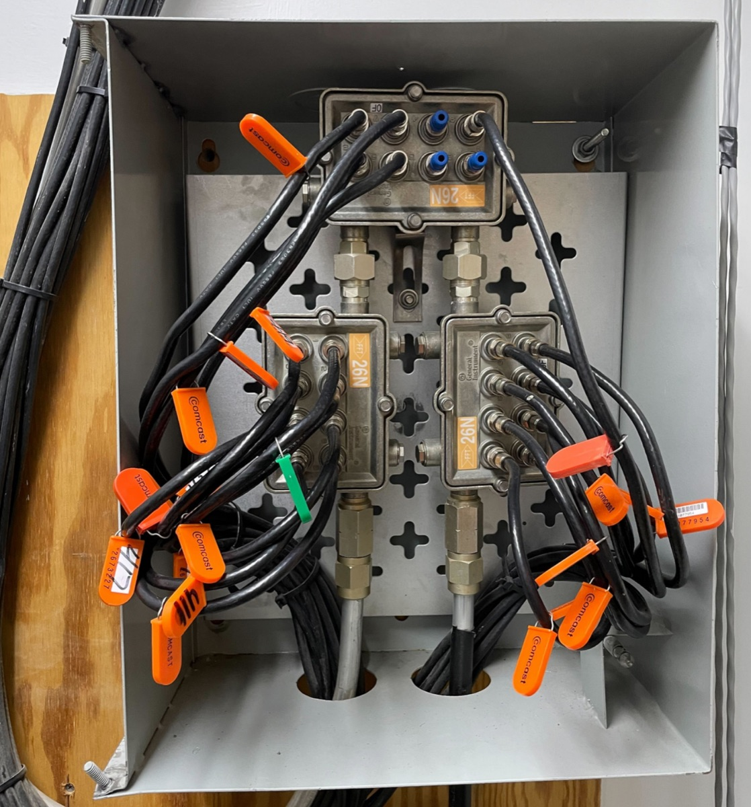
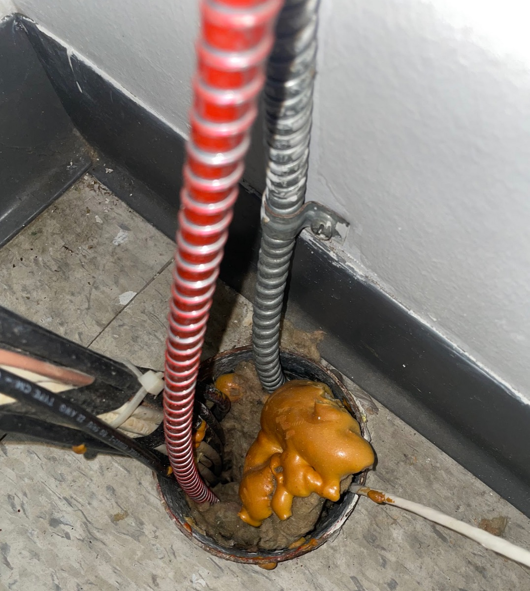

<!-- TODO: machine-drafted Spanish translation — needs review by a fluent speaker. -->
!!! note "Traducción preliminar"
    Esta página es una traducción preliminar y está pendiente de revisión. Si encuentra un error, la [versión en inglés](../../../../installations/handbook/safety-buildings-electrical/) es la referencia.

# Seguridad en edificios y eléctrica

## Notas sobre la infraestructura de Internet preinstalada

PCW trabaja a menudo en entornos que ya cuentan con infraestructura de Internet preexistente. Al hacer nuestras instalaciones, podemos estar cerca de cableado/infraestructura de red/etc. existentes que podrían verse afectados o dañados por el trabajo de nuestra instalación.

### Comercial

En edificios comerciales que ya tienen Internet instalado, es posible que vea algo como esto:

Arriba se muestra una caja de fibra óptica, usada con un sistema híbrido de fibra y coaxial. La caja negra de arriba contiene la fibra del proveedor de fibra, y el amplificador de línea convierte las señales de fibra óptica (haces de luz) en señales eléctricas de radiofrecuencia que se transportan por cable coaxial hacia abajo. Probablemente estará conectada a algo como esto:

Arriba se muestra un derivador (tap) coaxial y uno o varios divisores: es como un switch, pero para coaxial. Recibe su conexión de Internet de subida a través de los cables coaxiales grandes de abajo, y luego los dispositivos a los que está conectado cada cable coaxial etiquetado van a cada abonado individual.

## Techos y techado

Como principio rector, nunca taladramos en las partes del techo sobre las que podemos pararnos.

El aspecto más importante de nuestro trabajo en techos es no permitir la entrada de humedad, que puede acumularse y dañar un edificio desde dentro hacia fuera sin ser visible hasta que aparece una gotera u otro daño. Aprender sobre la anatomía del techo puede ayudarnos a entender la mejor manera de montar nuestro equipo sin comprometer la integridad del techo. Obtenga más información sobre las partes del borde de un techo (tapajuntas, goterón, fascia, sofito) en [Roof Anatomy and Parts Explained](https://roofs.wiki/Roof_Anatomy_and_Parts_Explained).

## Sistemas de seguridad/extinción de incendios

Al trabajar en cuartos de telecomunicaciones o mecánicos, a menudo estamos muy cerca de alarmas y sistemas de extinción de incendios. En general, si un cable/conducto es de color rojo, es probable que esté relacionado con un sistema de extinción o una alarma de incendios, aunque no es una regla absoluta.

### Espuma cortafuego (también llamada "Fireblock" o "Firestop")

La espuma cortafuego suele instalarse sobre/dentro de los conductos para ayudar a evitar que el fuego se propague entre los pisos de un edificio. La espuma se expande y se endurece al exponerse a altas temperaturas, creando un sello. Para cumplir con la normativa, la espuma/el cortafuego debe formar un sello completo alrededor de la perforación.

Generalmente se instala en los conductos así: cortafuego arriba, y luego aislamiento o lana mineral que también sirve de respaldo/relleno, mientras que el cortafuego es lo que impide la propagación real del humo y el fuego.

En esta imagen, el cortafuego es la espuma naranja en la parte superior del conducto; observe el aislamiento amarillo visible debajo, dentro del propio conducto.

### Puertas cortafuego

Nunca taladramos a través de las puertas cortafuego ni justo al lado de ellas, ya que esto viola su integridad cortafuego.

## Electricidad

Aunque PCW trabaja principalmente con cables y dispositivos de bajo voltaje (50 V o menos), a menudo estamos en entornos donde nos encontramos muy cerca de voltajes/amperajes más altos.

### Tipos comunes de cable eléctrico

Romex: la corriente en interiores suele transportarse por este cable plano no metálico (NM). El Romex tiene un código de colores según el calibre y el amperaje. Obtenga más información sobre el código de colores en [este boletín de NEMA](https://www.nema.org/docs/default-source/technical-document-library/type-nm-b-cable-jacket-color-coding-for-conductor-size-idenification.pdf).

### El conducto y usted

En exteriores, el cable eléctrico suele ir encerrado en algún tipo de conducto. A menudo vemos conducto flexible de PVC, o conducto recto de acero.

### Cómo evitar interferencias de radiofrecuencia entre cables eléctricos

Evite pasar cables de telecomunicaciones y eléctricos por las mismas perforaciones (mantenga al menos 2 pulgadas de separación). Si los cables de telecomunicaciones y eléctricos tienen que cruzarse, crúcelos en perpendicular para minimizar la interferencia (el único punto de contacto es donde se cruzan, en lugar de ir en paralelo). El Ethernet usa pares trenzados también para ayudar a lidiar con las interferencias. Usar cable apantallado (FTP) ayuda a reducir la interferencia aún más.

Consulte también: [Códigos aplicables | Departamento de Licencias e Inspecciones | Ciudad de Filadelfia](https://www.phila.gov/departments/department-of-licenses-and-inspections/resources/applicable-codes/)
