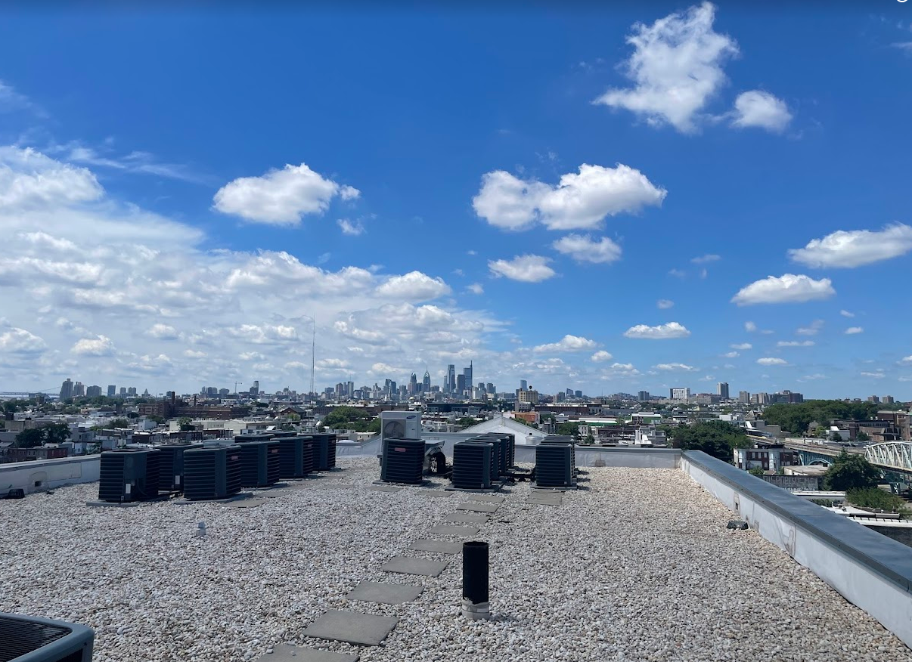

<!-- Borrador: traducción preliminar generada 2026-09-27 para revisión de Leanne. -->
# Planificación de la instalación

## Evaluación del edificio

PCW instala WiFi con regularidad en una amplia variedad de tipos de edificios, como casas adosadas, edificios multifamiliares (MDU), centros comunitarios y espacios públicos como parques y jardines.

Las evaluaciones suelen tomar entre 15 y 30 minutos. Asegúrese de tomar muchas fotos como referencia o para la planificación.

Para evaluar un edificio para una instalación, tenemos que hacernos las siguientes preguntas:

* **¿Tiene el edificio línea de vista (LoS) a un sitio alto de PhillyWisper o está cerca de un nodo de malla actual de PCW?**
    * Sin LoS directa a un sitio alto o a un nodo existente, el rendimiento del radio de enlace ascendente se verá significativamente degradado (si es que logra conectarse).
    * Google Earth puede ser una herramienta útil para determinar la posible LoS, pero en muchos casos puede ser necesaria una visita al sitio.
    * El follaje de los árboles puede causar una interferencia significativa: los sitios que son viables en invierno pueden quedar bloqueados por el follaje en verano.
    * Las construcciones nuevas también aparecen de repente. Es importante verificar las condiciones del lugar en persona, ya que Google maps, etc., puede no tener los alrededores más recientes actualizados.

* **¿Tiene el edificio un acceso fácil, seguro y sencillo a la azotea o al último piso?**
    * ¿Se necesitan escaleras? ¿Hay escaleras fijas o una escotilla de acceso a la azotea?
    * Lo ideal es instalar las LiteBeam en la azotea, ya sea mediante una estructura preexistente de la azotea, un soporte J-arm en la pared o un soporte de techo no penetrante.
    * ¿Tenemos permiso para montar equipos en el edificio o en las estructuras de la azotea?
    * PCW solo instala en techos planos, con raras excepciones.

* **¿Hay acceso a electricidad?**
    * Si está en el exterior, ¿está protegida la fuente de alimentación?
    * ¿La fuente de alimentación tendrá que ser usada por otra cosa? ¿Es accesible para otras personas que podrían desenchufar nuestro equipo?
    * ¿Hay perforaciones preexistentes que podamos reutilizar para llevar alimentación power-over-Ethernet desde el interior?
    * PCW no perfora techos, ya que son demasiado difíciles de impermeabilizar.

* **¿Hay formas fáciles de montar los puntos de acceso?**
    * p. ej.: postes existentes a los que simplemente podríamos sujetar los AP con bridas, frente a traer un soporte de techo no penetrante o un J-arm.
    * ¿Cuánto cable tendremos que tender?
    * ¿Qué tipo de puntos de acceso serán necesarios? Algunos no son resistentes a la intemperie y solo pueden usarse en interiores.
    * ¿Existe la posibilidad de que montar los puntos de acceso dañe el techo o las paredes?
    * ¿Hay infraestructura de Internet preexistente (instalaciones anteriores de cable coaxial o fibra) que debamos tener en cuenta? Los cables que corren en paralelo pueden interferir entre sí, degradando el rendimiento de ambas conexiones.

* **Si se requiere mantenimiento, ¿podremos volver en el futuro?**

Estas son algunas consideraciones al pensar en electricidad exterior frente a interior:

* PCW prefiere usar electricidad interior cuando es posible, especialmente en viviendas residenciales. Usar electricidad exterior crea un mayor riesgo de problemas relacionados con el agua en nuestro equipo.
* Usar electricidad interior nos obliga a tender cable hacia el interior de un edificio. En la mayoría de los casos en que usamos electricidad exterior, es porque el tendido de cable en el interior es significativamente más complicado.
* Si hay electricidad exterior existente que esperamos usar, es importante determinar si está disponible para nuestro uso o si se necesita para otros equipos exteriores.
* Toda fuente de electricidad exterior que se considere debe tener una tapa de tomacorriente apta para exteriores.

Como ejemplo, este es un sitio de instalación ideal:

<figure style="display: flex; align-items: center; flex-direction: column;">
    
    <figcaption>Un lugar ideal para una instalación en azotea en Kensington</figcaption>
</figure>

* La azotea está libre de escombros y es plana, con mucho espacio para soportes de techo no penetrantes.
* El edificio es más alto que casi todos los demás edificios de la zona, lo que le da LoS libre tanto a los sitios altos de PhillyWisper como a otros posibles sitios PtP/PtMP.
* Hay electricidad en la azotea, en este caso tomacorrientes GFCI con tapa.

## Ubicación de los puntos de acceso

Dónde va un punto de acceso importa tanto como cuál es el punto de acceso. Esta página explica cómo PCW
decide dónde colocar los AP: la diferencia entre un hub y un nodo, y qué tener en cuenta cuando un
nodo se enlaza en malla de forma inalámbrica en lugar de estar conectado por cable.

### Hubs y nodos

Los nodos de malla son instalaciones en las que no usamos una Litebeam, sino que configuramos un punto de acceso
inalámbrico que se enlaza en malla desde un punto de acceso cercano conectado por cable a un router y a una Litebeam en un hub local.

Si un sitio puede ser un hub se decide durante la [evaluación del edificio](#evaluacion-del-edificio):
un hub necesita línea de vista a un sitio alto de PhillyWisper. Un nodo no, pero sí necesita un buen
enlace inalámbrico de regreso a un hub, que es de lo que trata el resto de esta página.

Consulte también la página de [instalaciones típicas](https://wiki.nycmesh.net/books/2-install-maintenance-guides/page/typical-installs) de NYC Mesh para ver cómo una red similar describe sus tipos de instalación.

<!-- Ideas to note, 2026-09-27, from the retired Drive doc "Installation Overview - Public Docs" (its "Extra Notes on PCW install types"). Unverified; staff to confirm or rewrite before any of it goes visible.
1. Mesh node uses (doc's words): "Used for 1) relaying a signal to another mesh AP, and/or 2) providing a WiFi access point to a public, outdoor space. May provide a signal inside the building it is installed on, depending on placement and building construction."
2. A third type, mesh node + indoor AP (doc's words): "Same as a Mesh node, plus an additional access point installed inside the building to provide a home with stronger and more consistent signal indoors. The indoor AP may be another bunny ears, or any other home router." "PCW mounts a single Unifi Mesh AP with LOS to another Mesh AP, and runs an Ethernet cable into the home for a home router to be connected." Check: still offered? "any other home router" right?
3. Hubs (doc's words): "An indoor AP may also be installed if stronger and more consistent signal is required inside the house." "sometimes we use a 60ghz alternative" to the LiteBeam. Check: is 60 GHz still used?
5. PTMP installs are not described anywhere yet (Leanne, July 2026: "i'd add the newer PTMP to this too"). Needs a sentence or two from staff.
-->

### Consideraciones al instalar un nodo de malla

El artículo de Ubiquiti [Considerations for Optimal Wireless Mesh Networks](https://help.ui.com/hc/en-us/articles/115002262328-Considerations-for-Optimal-Wireless-Mesh-Networks)
es la referencia con la que trabajamos. Los puntos que surgen con más frecuencia en las instalaciones de PCW:

* **Las redes de malla deben ser complementarias**: aunque las redes de malla pueden funcionar de forma comparable a una red cableada, la calidad y la velocidad de la conexión pueden verse muy afectadas por el ruido de radiofrecuencia (RF) y por obstrucciones entre los AP, como paredes, árboles u otras estructuras.
* **Los "saltos" de malla deben minimizarse**: un AP en malla solo debe tener un "padre"; cada "salto" de malla, o conexión de malla entre AP, produce una disminución significativa del rendimiento. Lo ideal es que haya un máximo de dos "saltos"; p. ej., un AP de malla se enlaza con otro AP de malla, que a su vez se enlaza con un AP cableado.
* **Limite las conexiones simultáneas a un "padre"**: de igual modo, enlazar demasiados AP al mismo "padre" crea ruido de RF adicional y mayores exigencias de rendimiento para el padre, lo que se traduce en menor rendimiento y estabilidad.
* **Asegure una intensidad de señal fuerte entre los AP en malla**: lo ideal es que un AP en malla tenga línea de vista (LoS) despejada a su padre de malla. Se recomienda una intensidad de señal de -60 dBm para un rendimiento ideal. Asegúrese de que haya la menor cantidad posible de obstrucciones entre el AP en malla y el padre, como paredes, árboles, muebles, etc.

### Ubicación en exteriores

Los AP exteriores deben montarse donde sean visibles por radio para los AP de malla de las instalaciones domésticas
dentro del alcance, y lo bastante altos para superar lo que tengan alrededor. En los [nodos solares](solar.md), eso normalmente
significa que el AP va en la parte superior del mástil, con el panel y la caja montados debajo.

Para saber cómo configurar un AP una vez ubicado, consulte la guía
[Configurar los AP Unifi](../device-configuration/configure-ap-mesh.md).
