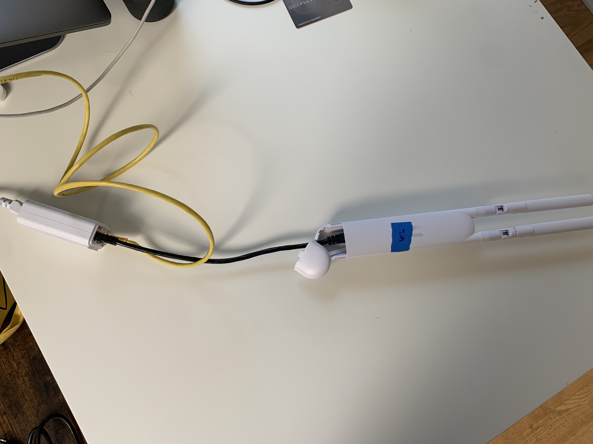
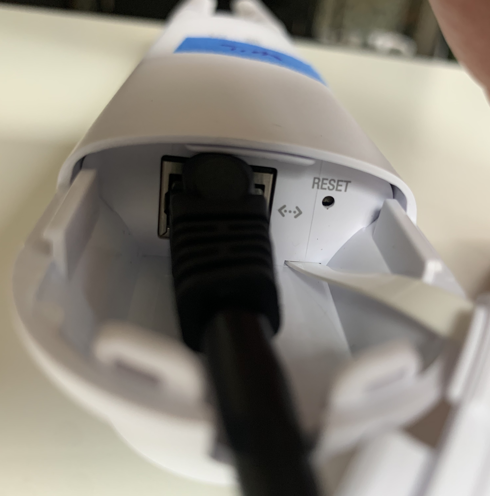
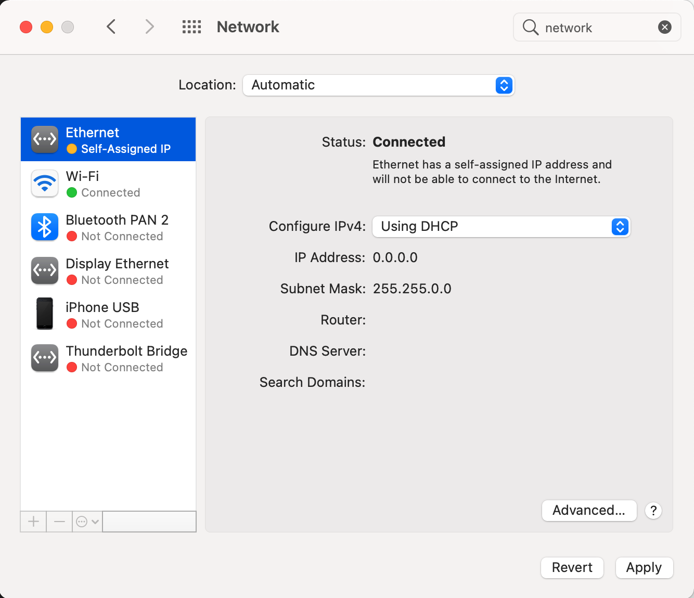

# Mesh Kit Setup Guide

## Installing AP Mesh Unit

If there is already an access point (with an ERX and wired rooftop antenna), then just the mesh antenna can be configured. For rooftop installations, see next section.

### Required Materials
- AP Mesh Unit (white Ubiquiti antenna with bunny ears)
- PoE injector
- Ethernet cable
- Computer
- Ethernet port on computer, or USB Ethernet adapter
- Paperclip
- Ubiquiti Chrome extension


### Helpful to Have
- Power strip/extension cord

### Setup Steps

1. Wire up your AP Mesh Unit.
    1. Plug the PoE injector into an outlet, or power strip.
    2. Connect the `POE` port of the injector to the AP Mesh Unit with an ethernet cable.
    3. Connect the `LAN` port of the injector to your computer, using the USB Ethernet adapter if you don't have an Ethernet port.
   
   
2. Factory reset AP Mesh Unit.
   
    The AP Mesh Units have had unexpected behavior even out of the box, so it is recommended to factory reset it before continuing.
    1. With the paperclip, press the reset button at the bottom of the AP Mesh Unit in until it clicks. 
    2. Hold it pressed in for 15 seconds. 
    3. Once the status light on the AP Mesh Unit has flashed and then gone out, the device has been reset.
3. Configure Network settings on computer.
   1. Mac Instructions
      1. Open up `System Preferences` > `Network`.
      2. Select the Ethernet connection you have with the AP Mesh Unit.
      
      3. Change the value of `Configure IPv4` to `Manually`.
      
      4. Set the IP Address to `192.168.1.29` (although most values should work here).
      5. Set the Subnet Mask to `255.255.255.0`
      
      6. Click `Apply`
   2. PC Instructions (TBA)
4. Connect to the AP Mesh Unit.
   1. Open a Terminal prompt.
      1. On Mac - Open the `Terminal` application.
   2. If you have previously connected to an AP Mesh Unit, you will need to edit your `known_hosts` file, or you will get an `Host key verification failed` error.
      1. Open `~/.ssh/known_hosts` with `vim`, `nano`, or the text editor of your choice.
      2. Remove the line beginning with `192.168.1.20` (It will look something like `192.168.1.20 ssh-rsa AAAAB3NzaC1yc2E...`), and save the file.
   3. Run the command `ssh ubnt@192.168.1.20`
   4. You may see the alert:

        ```
        The authenticity of host '192.168.1.20 (192.168.1.20)' can't be established.
        RSA key fingerprint is SHA256:oUG6ABM3uor6lfBpJFcnHWyhhPnCrIx2Jf0U1+UAg4g.
        Are you sure you want to continue connecting (yes/no/[fingerprint])?
        ```
        Press yes to continue.
   5. When prompted for the password, enter `ubnt`.
   6. You should now be connected to the AP Mesh Unit.
   
5. Adopt AP Mesh Unit
   1. From your `ssh` shell, run the command `set-inform http://unifi.phillycommunitywireless.org:8080/inform`:.
      - This will alert the HostiFi controller that the AP Mesh Unit wants to be adopted.
   2. Open the HostiFi portal in the Chrome browser.
   3. The AP Mesh Unit should appear in the list of devices awaiting adoption.
   4. Press `Adopt` to adopt the AP Mesh Unit.

### Troubleshooting
1. Computer doesn't recognize AP Mesh Unit in Network settings, or `ssh` command fails.
    - The AP Mesh Unit can take a few minutes to boot after being plugged in, so wait until the status light is solid white and try again.
2. What does this status light pattern mean?
    - [LED Color Patterns for UniFi Devices](https://help.ui.com/hc/en-us/articles/204910134-UniFi-LED-Color-Patterns-for-UniFi-Devices)

## Rooftop Installation

TBA
